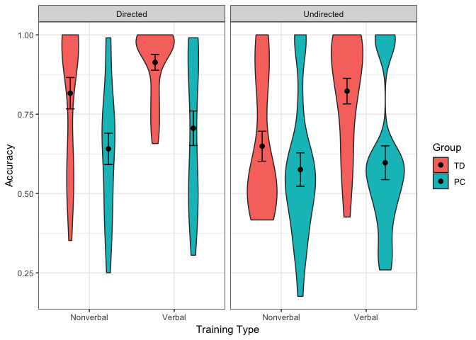

CompCat Data Analysis Script
================

Load libraries

``` r
library(reshape2)
library(reshape)
library(stringr)
library(plyr)
library(ggplot2)
library(nlme)
library(pastecs)
library(car)
library(psych)
library(fBasics)
library(Rmisc)
setwd("~/CompCat")
```

Data Cleaning
=============

We have a few different data sources here.

1.  `behavior.csv` contains the behavioral data (assessments, ages, etc.) for all of the participants.
2.  `exp_data.csv` contains the experimental data from the main category learning task (collected in E-Prime 2.0).
3.  `visualnorm.csv` contains aggregated similarity ratings for all of the stimulus pairings.

In this first step, we will select the relevant columns from `exp_data` and add in 3 types of visual similarity for each trial (probe-target, probe-distractor, and target-distractor), as well as a double-click indicator column for use in RT analyses.

``` r
#Read in data
dat0 <- read.csv("exp_data.csv")
visualnorm <- read.csv("visualnorm.csv")
#rename column 1 in visual norming
colnames(visualnorm)[1] <- "Robot"
#select just data from testing
dat1 <- subset(dat0, Block==2)
dat1$condition <- str_match(dat1$ExperimentName, "^([A-Za-z]{1,}_[A-Za-z]{1,})")[, 2]
dat1$train.type <- as.factor(str_match(dat1$ExperimentName, "^([A-Za-z]{1,})_")[, 2])
dat1$train.type <- revalue(dat1$train.type, c("Explicit" = "Directed", "Implicit" = "Undirected"))
dat1$info.type <- as.factor(str_match(dat1$ExperimentName, "^[A-Za-z]{1,}_([A-Za-z]{1,})_")[, 2])
#pick out the important variables --
#we can use Stimulus.Acc for test because there is only one response
# i.e. don't have to use NError
dat2 <- data.frame(dat1$Subject, dat1$condition, dat1$Trial, dat1$Probe_pic, 
                      dat1$target_pic, dat1$distractor_pic, dat1$Stimulus.ACC, 
                      dat1$Stimulus.RESP, dat1$Stimulus.RT, dat1$info.type, dat1$train.type)
dat2$doubleclick <- NA
#rename columns
names(dat2) <- c("Subj","condition", "Trial", "probepic","target_pic",
                    "distractor_pic","Acc","Resp","RT","info.type", "train.type", "doubleclick")
#if they double clicked, this column has a 1. If not, a 0
#double clicks should be removed when analyzing RT
dat2[dat2$Resp > 2, "doubleclick"] <- 1
dat2[dat2$Resp == 1, "doubleclick"] <- 0

#put visual norming data into a better format
vissim <- melt.data.frame(visualnorm, id.vars="Robot")
names(vissim) <- c("Rob1","Rob2","sim")

#add columns for visual similarity
#probe-target
dat1$vs.pt <- NA
#probe-distractor
dat1$vs.pd <- NA
#target-distractor
dat1$vs.td <- NA

#fill in probe-target visual similarity
#merge e-prime data with visual norming data
vs.pt <- merge(dat2, vissim, by.x=c("probepic", "target_pic"), by.y=c("Rob1", "Rob2"), all=T)
#remove excess columns
vs.pt <- vs.pt[!is.na(vs.pt$Subj),]
#sort by subject and trial
vs.pt.sort<- vs.pt[order(vs.pt$Subj, vs.pt$Trial),] 
#put the visual similarity column in the overall data frame
dat2$vs.pt <- vs.pt.sort$sim

#fill in probe-distractor visual similarity
vs.pd <- merge(dat2, vissim, by.x=c("probepic", "distractor_pic"), by.y=c("Rob1", "Rob2"), all=T)
vs.pd <- vs.pd[!is.na(vs.pd$Subj),]
vs.pd.sort<- vs.pd[order(vs.pd$Subj, vs.pd$Trial),] 
dat2$vs.pd <- vs.pd.sort$sim

#fill in target-distractor visual similarity
vs.td <- merge(dat2, vissim, by.x=c("target_pic", "distractor_pic"), by.y=c("Rob1", "Rob2"), all=T)
vs.td <- vs.td[!is.na(vs.td$Subj),]
vs.td.sort<- vs.td[order(vs.td$Subj, vs.td$Trial),] 
dat2$vs.td <- vs.td.sort$sim
```

Now we will calculate the average accuracy for each subject for each condition.

``` r
acc <- data.frame(tapply(dat2$Acc, list(dat2$Subj, dat2$condition), mean))
acc$Subj <- as.numeric(rownames(acc))
acc.melt <- melt.data.frame(acc, id.vars = "Subj")
names(acc.melt) <- c("Subj", "Cond", "Acc")
acc.melt$train.type <- as.factor(str_match(acc.melt$Cond, "^([A-Za-z]{1,})_")[, 2])
acc.melt$train.type <- revalue(acc.melt$train.type, c("Explicit" = "Directed", "Implicit" = "Undirected"))
acc.melt$info.type <- as.factor(str_match(acc.melt$Cond, "^[A-Za-z]{1,}_([A-Za-z]{1,})")[, 2])
```

Now we will merge all of the behavioral data into both the raw data and the aggregated data.

``` r
behavior <- read.csv("behavior.csv")
behavior$Group <- factor(behavior$Group, levels(behavior$Group)[c(2,1)])
dat3 <- merge(dat2, behavior, by = "Subj")
acc_beh <- merge(acc.melt, behavior, by = "Subj")
```

Group Analysis
==============

For the group analysis, we want to only use people with a WA of greater than 95 and a KTEA of less than 90 or greater than 100.

``` r
acc_group <- acc_beh[acc_beh$KTEA_SS <= 90 | acc_beh$KTEA_SS >= 100,]
min(acc_group$WA_SS)
```

    ## [1] 95

``` r
min(acc_group$P_IQ)
```

    ## [1] 80

``` r
# check number of subjects
length(table(acc_group$Subj))
```

    ## [1] 39

``` r
subs_groups <- data.frame(acc_group$Subj, acc_group$Group)
subs_groups <- unique(subs_groups)
table(subs_groups$acc_group.Group)
```

    ## 
    ## TD PC 
    ## 20 19

Descriptive Statistics
----------------------

``` r
beh_group <- behavior[behavior$KTEA_SS <= 90 | behavior$KTEA_SS >= 100,]
by(beh_group$KTEA_SS, list(beh_group$Group), mean)
```

    ## : TD
    ## [1] 112.55
    ## -------------------------------------------------------- 
    ## : PC
    ## [1] 84.15789

``` r
by(beh_group$KTEA_SS, list(beh_group$Group), sd)
```

    ## : TD
    ## [1] 8.816701
    ## -------------------------------------------------------- 
    ## : PC
    ## [1] 5.871429

``` r
t.test(beh_group$KTEA_SS ~ beh_group$Group)
```

    ## 
    ##  Welch Two Sample t-test
    ## 
    ## data:  beh_group$KTEA_SS by beh_group$Group
    ## t = 11.891, df = 33.235, p-value = 1.613e-13
    ## alternative hypothesis: true difference in means is not equal to 0
    ## 95 percent confidence interval:
    ##  23.53559 33.24862
    ## sample estimates:
    ## mean in group TD mean in group PC 
    ##        112.55000         84.15789

``` r
by(beh_group$WA_SS, list(beh_group$Group), mean)
```

    ## : TD
    ## [1] 107.8
    ## -------------------------------------------------------- 
    ## : PC
    ## [1] 101.7895

``` r
by(beh_group$WA_SS, list(beh_group$Group), sd)
```

    ## : TD
    ## [1] 8.563079
    ## -------------------------------------------------------- 
    ## : PC
    ## [1] 5.798266

``` r
t.test(beh_group$WA_SS ~ beh_group$Group)
```

    ## 
    ##  Welch Two Sample t-test
    ## 
    ## data:  beh_group$WA_SS by beh_group$Group
    ## t = 2.578, df = 33.523, p-value = 0.01451
    ## alternative hypothesis: true difference in means is not equal to 0
    ## 95 percent confidence interval:
    ##   1.269912 10.751141
    ## sample estimates:
    ## mean in group TD mean in group PC 
    ##         107.8000         101.7895

``` r
by(beh_group$P_IQ, list(beh_group$Group), mean)
```

    ## : TD
    ## [1] 114.65
    ## -------------------------------------------------------- 
    ## : PC
    ## [1] 94.47368

``` r
by(beh_group$P_IQ, list(beh_group$Group), sd)
```

    ## : TD
    ## [1] 12.35559
    ## -------------------------------------------------------- 
    ## : PC
    ## [1] 8.572361

``` r
t.test(beh_group$P_IQ ~ beh_group$Group)
```

    ## 
    ##  Welch Two Sample t-test
    ## 
    ## data:  beh_group$P_IQ by beh_group$Group
    ## t = 5.9495, df = 33.936, p-value = 1.009e-06
    ## alternative hypothesis: true difference in means is not equal to 0
    ## 95 percent confidence interval:
    ##  13.28396 27.06868
    ## sample estimates:
    ## mean in group TD mean in group PC 
    ##        114.65000         94.47368

``` r
by(acc_group$Acc, list(acc_group$info.type, acc_group$train.type), stat.desc)
```

    ## : Nonverbal
    ## : Directed
    ##      nbr.val     nbr.null       nbr.na          min          max 
    ##  39.00000000   0.00000000   0.00000000   0.25000000   1.00000000 
    ##        range          sum       median         mean      SE.mean 
    ##   0.75000000  28.50000000   0.73148148   0.73076923   0.03732858 
    ## CI.mean.0.95          var      std.dev     coef.var 
    ##   0.07556775   0.05434348   0.23311688   0.31900205 
    ## -------------------------------------------------------- 
    ## : Verbal
    ## : Directed
    ##      nbr.val     nbr.null       nbr.na          min          max 
    ##  39.00000000   0.00000000   0.00000000   0.30555556   1.00000000 
    ##        range          sum       median         mean      SE.mean 
    ##   0.69444444  31.67592593   0.92592593   0.81220323   0.03357472 
    ## CI.mean.0.95          var      std.dev     coef.var 
    ##   0.06796846   0.04396320   0.20967403   0.25815464 
    ## -------------------------------------------------------- 
    ## : Nonverbal
    ## : Undirected
    ##      nbr.val     nbr.null       nbr.na          min          max 
    ##  39.00000000   0.00000000   0.00000000   0.17592593   1.00000000 
    ##        range          sum       median         mean      SE.mean 
    ##   0.82407407  23.91666667   0.54629630   0.61324786   0.03531389 
    ## CI.mean.0.95          var      std.dev     coef.var 
    ##   0.07148923   0.04863576   0.22053516   0.35961830 
    ## -------------------------------------------------------- 
    ## : Verbal
    ## : Undirected
    ##      nbr.val     nbr.null       nbr.na          min          max 
    ##  39.00000000   0.00000000   0.00000000   0.25925926   1.00000000 
    ##        range          sum       median         mean      SE.mean 
    ##   0.74074074  27.79629630   0.62962963   0.71272555   0.03751887 
    ## CI.mean.0.95          var      std.dev     coef.var 
    ##   0.07595298   0.05489896   0.23430526   0.32874543

``` r
by(acc_group$Acc, list(acc_group$info.type, acc_group$train.type, acc_group$Group), stat.desc)
```

    ## : Nonverbal
    ## : Directed
    ## : TD
    ##      nbr.val     nbr.null       nbr.na          min          max 
    ##  20.00000000   0.00000000   0.00000000   0.35185185   1.00000000 
    ##        range          sum       median         mean      SE.mean 
    ##   0.64814815  16.32407407   0.93981481   0.81620370   0.04946411 
    ## CI.mean.0.95          var      std.dev     coef.var 
    ##   0.10352958   0.04893397   0.22121023   0.27102331 
    ## -------------------------------------------------------- 
    ## : Verbal
    ## : Directed
    ## : TD
    ##      nbr.val     nbr.null       nbr.na          min          max 
    ##  20.00000000   0.00000000   0.00000000   0.65740741   1.00000000 
    ##        range          sum       median         mean      SE.mean 
    ##   0.34259259  18.26851852   0.96296296   0.91342593   0.02489306 
    ## CI.mean.0.95          var      std.dev     coef.var 
    ##   0.05210176   0.01239328   0.11132513   0.12187647 
    ## -------------------------------------------------------- 
    ## : Nonverbal
    ## : Undirected
    ## : TD
    ##      nbr.val     nbr.null       nbr.na          min          max 
    ##  20.00000000   0.00000000   0.00000000   0.41666667   1.00000000 
    ##        range          sum       median         mean      SE.mean 
    ##   0.58333333  12.98148148   0.55092593   0.64907407   0.04726998 
    ## CI.mean.0.95          var      std.dev     coef.var 
    ##   0.09893720   0.04468901   0.21139776   0.32569127 
    ## -------------------------------------------------------- 
    ## : Verbal
    ## : Undirected
    ## : TD
    ##      nbr.val     nbr.null       nbr.na          min          max 
    ##  20.00000000   0.00000000   0.00000000   0.42592593   1.00000000 
    ##        range          sum       median         mean      SE.mean 
    ##   0.57407407  16.45370370   0.87037037   0.82268519   0.04042874 
    ## CI.mean.0.95          var      std.dev     coef.var 
    ##   0.08461831   0.03268965   0.18080280   0.21977155 
    ## -------------------------------------------------------- 
    ## : Nonverbal
    ## : Directed
    ## : PC
    ##      nbr.val     nbr.null       nbr.na          min          max 
    ##  19.00000000   0.00000000   0.00000000   0.25000000   0.99074074 
    ##        range          sum       median         mean      SE.mean 
    ##   0.74074074  12.17592593   0.66666667   0.64083821   0.04943132 
    ## CI.mean.0.95          var      std.dev     coef.var 
    ##   0.10385135   0.04642565   0.21546612   0.33622546 
    ## -------------------------------------------------------- 
    ## : Verbal
    ## : Directed
    ## : PC
    ##      nbr.val     nbr.null       nbr.na          min          max 
    ##  19.00000000   0.00000000   0.00000000   0.30555556   0.99074074 
    ##        range          sum       median         mean      SE.mean 
    ##   0.68518519  13.40740741   0.68518519   0.70565302   0.05446450 
    ## CI.mean.0.95          var      std.dev     coef.var 
    ##   0.11442567   0.05636125   0.23740525   0.33643341 
    ## -------------------------------------------------------- 
    ## : Nonverbal
    ## : Undirected
    ## : PC
    ##      nbr.val     nbr.null       nbr.na          min          max 
    ##  19.00000000   0.00000000   0.00000000   0.17592593   1.00000000 
    ##        range          sum       median         mean      SE.mean 
    ##   0.82407407  10.93518519   0.54629630   0.57553606   0.05260400 
    ## CI.mean.0.95          var      std.dev     coef.var 
    ##   0.11051690   0.05257643   0.22929550   0.39840337 
    ## -------------------------------------------------------- 
    ## : Verbal
    ## : Undirected
    ## : PC
    ##      nbr.val     nbr.null       nbr.na          min          max 
    ##  19.00000000   0.00000000   0.00000000   0.25925926   1.00000000 
    ##        range          sum       median         mean      SE.mean 
    ##   0.74074074  11.34259259   0.58333333   0.59697856   0.05322040 
    ## CI.mean.0.95          var      std.dev     coef.var 
    ##   0.11181191   0.05381581   0.23198235   0.38859410

*t*-tests
---------

To look for evidence of learning (acc &gt; 0.5), we will use some *t*-tests.

``` r
ENV <- subset(acc_group, Cond == "Explicit_Nonverbal")
ENV.TD <- subset(ENV, Group == "TD")
ENV.SRCD <- subset(ENV, Group == "PC")
t.test(ENV.TD$Acc, mu = 0.5)
```

    ## 
    ##  One Sample t-test
    ## 
    ## data:  ENV.TD$Acc
    ## t = 6.3926, df = 19, p-value = 3.941e-06
    ## alternative hypothesis: true mean is not equal to 0.5
    ## 95 percent confidence interval:
    ##  0.7126741 0.9197333
    ## sample estimates:
    ## mean of x 
    ## 0.8162037

``` r
t.test(ENV.SRCD$Acc, mu = 0.5)
```

    ## 
    ##  One Sample t-test
    ## 
    ## data:  ENV.SRCD$Acc
    ## t = 2.8492, df = 18, p-value = 0.01065
    ## alternative hypothesis: true mean is not equal to 0.5
    ## 95 percent confidence interval:
    ##  0.5369869 0.7446896
    ## sample estimates:
    ## mean of x 
    ## 0.6408382

``` r
INV <- subset(acc_group, Cond == "Implicit_Nonverbal")
INV.TD <- subset(INV, Group == "TD")
INV.SRCD <- subset(INV, Group == "PC")
t.test(INV.TD$Acc, mu = 0.5)
```

    ## 
    ##  One Sample t-test
    ## 
    ## data:  INV.TD$Acc
    ## t = 3.1537, df = 19, p-value = 0.005229
    ## alternative hypothesis: true mean is not equal to 0.5
    ## 95 percent confidence interval:
    ##  0.5501369 0.7480113
    ## sample estimates:
    ## mean of x 
    ## 0.6490741

``` r
t.test(INV.SRCD$Acc, mu = 0.5)
```

    ## 
    ##  One Sample t-test
    ## 
    ## data:  INV.SRCD$Acc
    ## t = 1.4359, df = 18, p-value = 0.1682
    ## alternative hypothesis: true mean is not equal to 0.5
    ## 95 percent confidence interval:
    ##  0.4650192 0.6860530
    ## sample estimates:
    ## mean of x 
    ## 0.5755361

``` r
EV <- subset(acc_group, Cond == "Explicit_Verbal")
EV.TD <- subset(EV, Group == "TD")
EV.SRCD <- subset(EV, Group == "PC")
t.test(EV.TD$Acc, mu = 0.5)
```

    ## 
    ##  One Sample t-test
    ## 
    ## data:  EV.TD$Acc
    ## t = 16.608, df = 19, p-value = 9.061e-13
    ## alternative hypothesis: true mean is not equal to 0.5
    ## 95 percent confidence interval:
    ##  0.8613242 0.9655277
    ## sample estimates:
    ## mean of x 
    ## 0.9134259

``` r
t.test(EV.SRCD$Acc, mu = 0.5)
```

    ## 
    ##  One Sample t-test
    ## 
    ## data:  EV.SRCD$Acc
    ## t = 3.7759, df = 18, p-value = 0.001384
    ## alternative hypothesis: true mean is not equal to 0.5
    ## 95 percent confidence interval:
    ##  0.5912274 0.8200787
    ## sample estimates:
    ## mean of x 
    ##  0.705653

``` r
IV <- subset(acc_group, Cond == "Implicit_Verbal")
IV.TD <- subset(IV, Group == "TD")
IV.SRCD <- subset(IV, Group == "PC")
t.test(IV.TD$Acc, mu = 0.5)
```

    ## 
    ##  One Sample t-test
    ## 
    ## data:  IV.TD$Acc
    ## t = 7.9816, df = 19, p-value = 1.734e-07
    ## alternative hypothesis: true mean is not equal to 0.5
    ## 95 percent confidence interval:
    ##  0.7380669 0.9073035
    ## sample estimates:
    ## mean of x 
    ## 0.8226852

``` r
t.test(IV.SRCD$Acc, mu = 0.5)
```

    ## 
    ##  One Sample t-test
    ## 
    ## data:  IV.SRCD$Acc
    ## t = 1.8222, df = 18, p-value = 0.08508
    ## alternative hypothesis: true mean is not equal to 0.5
    ## 95 percent confidence interval:
    ##  0.4851666 0.7087905
    ## sample estimates:
    ## mean of x 
    ## 0.5969786

Linear Mixed-Effects Models
---------------------------

### Standard Analysis

Group x Information Type x Training Type

``` r
acc_group$acc.logit <- car::logit(acc_group$Acc)

# add task effects
m0 <- lme(acc.logit ~ 1, random = ~1|Subj, data = acc_group, method = "ML")
summary(m0)
```

    ## Linear mixed-effects model fit by maximum likelihood
    ##  Data: acc_group 
    ##        AIC      BIC    logLik
    ##   499.8637 509.0133 -246.9319
    ## 
    ## Random effects:
    ##  Formula: ~1 | Subj
    ##         (Intercept)  Residual
    ## StdDev:    1.143842 0.9210212
    ## 
    ## Fixed effects: acc.logit ~ 1 
    ##                Value Std.Error  DF  t-value p-value
    ## (Intercept) 1.309999  0.198084 117 6.613348       0
    ## 
    ## Standardized Within-Group Residuals:
    ##         Min          Q1         Med          Q3         Max 
    ## -2.50922445 -0.55394788 -0.01941236  0.52004838  2.50742954 
    ## 
    ## Number of Observations: 156
    ## Number of Groups: 39

``` r
m0.0 <- lme(acc.logit ~ train.type + info.type, random = ~1|Subj, data = acc_group, method = "ML")
anova(m0,m0.0)
```

    ##      Model df      AIC      BIC    logLik   Test  L.Ratio p-value
    ## m0       1  3 499.8637 509.0133 -246.9318                        
    ## m0.0     2  5 465.4306 480.6798 -227.7153 1 vs 2 38.43316  <.0001

``` r
# add task effects and group over and above PIQ and decoding
m0.5 <- lme(acc.logit ~ P_IQ + WA_SS, random = ~1|Subj, data = acc_group, method = "ML")
m1 <- lme(acc.logit ~ P_IQ + WA_SS + Group * train.type * info.type, random = ~1|Subj, data = acc_group, method = "ML")
summary(m1)
```

    ## Linear mixed-effects model fit by maximum likelihood
    ##  Data: acc_group 
    ##        AIC      BIC    logLik
    ##   456.8754 493.4736 -216.4377
    ## 
    ## Random effects:
    ##  Formula: ~1 | Subj
    ##         (Intercept)  Residual
    ## StdDev:   0.9881981 0.7472297
    ## 
    ## Fixed effects: acc.logit ~ P_IQ + WA_SS + Group * train.type * info.type 
    ##                                                  Value Std.Error  DF
    ## (Intercept)                                  -4.010552 3.0467522 111
    ## P_IQ                                          0.004107 0.0170469  35
    ## WA_SS                                         0.051127 0.0247818  35
    ## GroupPC                                      -0.813277 0.5399742  35
    ## train.typeUndirected                         -1.109413 0.2442530 111
    ## info.typeVerbal                               0.561352 0.2442530 111
    ## GroupPC:train.typeUndirected                  0.852581 0.3499415 111
    ## GroupPC:info.typeVerbal                      -0.135719 0.3499415 111
    ## train.typeUndirected:info.typeVerbal          0.449453 0.3454260 111
    ## GroupPC:train.typeUndirected:info.typeVerbal -0.726304 0.4948921 111
    ##                                                t-value p-value
    ## (Intercept)                                  -1.316337  0.1908
    ## P_IQ                                          0.240905  0.8110
    ## WA_SS                                         2.063093  0.0466
    ## GroupPC                                      -1.506141  0.1410
    ## train.typeUndirected                         -4.542066  0.0000
    ## info.typeVerbal                               2.298241  0.0234
    ## GroupPC:train.typeUndirected                  2.436353  0.0164
    ## GroupPC:info.typeVerbal                      -0.387834  0.6989
    ## train.typeUndirected:info.typeVerbal          1.301155  0.1959
    ## GroupPC:train.typeUndirected:info.typeVerbal -1.467601  0.1450
    ##  Correlation: 
    ##                                              (Intr) P_IQ   WA_SS  GropPC
    ## P_IQ                                         -0.494                     
    ## WA_SS                                        -0.769 -0.168              
    ## GroupPC                                      -0.577  0.591  0.169       
    ## train.typeUndirected                         -0.040  0.000  0.000  0.226
    ## info.typeVerbal                              -0.040  0.000  0.000  0.226
    ## GroupPC:train.typeUndirected                  0.028  0.000  0.000 -0.324
    ## GroupPC:info.typeVerbal                       0.028  0.000  0.000 -0.324
    ## train.typeUndirected:info.typeVerbal          0.028  0.000  0.000 -0.160
    ## GroupPC:train.typeUndirected:info.typeVerbal -0.020  0.000  0.000  0.229
    ##                                              trn.tU inf.tV GrPC:.U GPC:.V
    ## P_IQ                                                                     
    ## WA_SS                                                                    
    ## GroupPC                                                                  
    ## train.typeUndirected                                                     
    ## info.typeVerbal                               0.500                      
    ## GroupPC:train.typeUndirected                 -0.698 -0.349               
    ## GroupPC:info.typeVerbal                      -0.349 -0.698  0.500        
    ## train.typeUndirected:info.typeVerbal         -0.707 -0.707  0.494   0.494
    ## GroupPC:train.typeUndirected:info.typeVerbal  0.494  0.494 -0.707  -0.707
    ##                                              t.U:.V
    ## P_IQ                                               
    ## WA_SS                                              
    ## GroupPC                                            
    ## train.typeUndirected                               
    ## info.typeVerbal                                    
    ## GroupPC:train.typeUndirected                       
    ## GroupPC:info.typeVerbal                            
    ## train.typeUndirected:info.typeVerbal               
    ## GroupPC:train.typeUndirected:info.typeVerbal -0.698
    ## 
    ## Standardized Within-Group Residuals:
    ##         Min          Q1         Med          Q3         Max 
    ## -2.15519128 -0.56930008  0.02437132  0.58799812  2.55152492 
    ## 
    ## Number of Observations: 156
    ## Number of Groups: 39

``` r
anova(m0.5,m1)
```

    ##      Model df      AIC      BIC    logLik   Test  L.Ratio p-value
    ## m0.5     1  5 493.5303 508.7796 -241.7652                        
    ## m1       2 12 456.8754 493.4736 -216.4377 1 vs 2 50.65496  <.0001

``` r
## unpacking interaction between group and training type
PCSubset <- acc_group$Group=="PC"
TDSubset <- acc_group$Group=="TD"
tdModel <- lme(acc.logit ~ P_IQ + WA_SS + train.type * info.type, random = ~1|Subj, data = acc_group, subset = PCSubset, method = "ML")
summary(tdModel)
```

    ## Linear mixed-effects model fit by maximum likelihood
    ##  Data: acc_group 
    ##   Subset: PCSubset 
    ##        AIC      BIC    logLik
    ##   203.5734 222.2192 -93.78668
    ## 
    ## Random effects:
    ##  Formula: ~1 | Subj
    ##         (Intercept)  Residual
    ## StdDev:   0.9962869 0.6117928
    ## 
    ## Fixed effects: acc.logit ~ P_IQ + WA_SS + train.type * info.type 
    ##                                           Value Std.Error DF    t-value
    ## (Intercept)                          -13.150921  5.528892 54 -2.3785816
    ## P_IQ                                   0.028418  0.029964 16  0.9484007
    ## WA_SS                                  0.110370  0.044300 16  2.4914112
    ## train.typeUndirected                  -0.256832  0.206824 54 -1.2417931
    ## info.typeVerbal                        0.425633  0.206824 54  2.0579513
    ## train.typeUndirected:info.typeVerbal  -0.276851  0.292493 54 -0.9465229
    ##                                      p-value
    ## (Intercept)                           0.0209
    ## P_IQ                                  0.3570
    ## WA_SS                                 0.0241
    ## train.typeUndirected                  0.2197
    ## info.typeVerbal                       0.0444
    ## train.typeUndirected:info.typeVerbal  0.3481
    ##  Correlation: 
    ##                                      (Intr) P_IQ   WA_SS  trn.tU inf.tV
    ## P_IQ                                 -0.580                            
    ## WA_SS                                -0.859  0.084                     
    ## train.typeUndirected                 -0.019  0.000  0.000              
    ## info.typeVerbal                      -0.019  0.000  0.000  0.500       
    ## train.typeUndirected:info.typeVerbal  0.013  0.000  0.000 -0.707 -0.707
    ## 
    ## Standardized Within-Group Residuals:
    ##         Min          Q1         Med          Q3         Max 
    ## -1.97724996 -0.52010884 -0.02230884  0.46071853  3.10611776 
    ## 
    ## Number of Observations: 76
    ## Number of Groups: 19

``` r
pcModel <- lme(acc.logit ~ P_IQ + WA_SS + train.type * info.type, random = ~1|Subj, data = acc_group, subset = TDSubset, method = "ML")
summary(pcModel)
```

    ## Linear mixed-effects model fit by maximum likelihood
    ##  Data: acc_group 
    ##   Subset: TDSubset 
    ##        AIC     BIC    logLik
    ##   251.4228 270.479 -117.7114
    ## 
    ## Random effects:
    ##  Formula: ~1 | Subj
    ##         (Intercept)  Residual
    ## StdDev:   0.8840984 0.8562773
    ## 
    ## Fixed effects: acc.logit ~ P_IQ + WA_SS + train.type * info.type 
    ##                                           Value Std.Error DF   t-value
    ## (Intercept)                          -1.0071643  3.279177 57 -0.307139
    ## P_IQ                                 -0.0011107  0.019757 17 -0.056218
    ## WA_SS                                 0.0288154  0.028507 17  1.010827
    ## train.typeUndirected                 -1.1094134  0.281542 57 -3.940486
    ## info.typeVerbal                       0.5613524  0.281542 57  1.993848
    ## train.typeUndirected:info.typeVerbal  0.4494528  0.398161 57  1.128822
    ##                                      p-value
    ## (Intercept)                           0.7599
    ## P_IQ                                  0.9558
    ## WA_SS                                 0.3263
    ## train.typeUndirected                  0.0002
    ## info.typeVerbal                       0.0510
    ## train.typeUndirected:info.typeVerbal  0.2637
    ##  Correlation: 
    ##                                      (Intr) P_IQ   WA_SS  trn.tU inf.tV
    ## P_IQ                                 -0.428                            
    ## WA_SS                                -0.743 -0.280                     
    ## train.typeUndirected                 -0.043  0.000  0.000              
    ## info.typeVerbal                      -0.043  0.000  0.000  0.500       
    ## train.typeUndirected:info.typeVerbal  0.030  0.000  0.000 -0.707 -0.707
    ## 
    ## Standardized Within-Group Residuals:
    ##        Min         Q1        Med         Q3        Max 
    ## -1.9023423 -0.7801925  0.1037513  0.6677532  1.9013446 
    ## 
    ## Number of Observations: 80
    ## Number of Groups: 20

### Order Analysis

Group x Information Type x Training Type x Order

``` r
# add order
m2 <- lme(acc.logit ~ P_IQ + WA_SS + Order * Group * train.type * info.type, random = ~1|Subj, data = acc_group, method = "ML")
summary(m2)
```

    ## Linear mixed-effects model fit by maximum likelihood
    ##  Data: acc_group 
    ##       AIC      BIC    logLik
    ##   431.047 492.0442 -195.5235
    ## 
    ## Random effects:
    ##  Formula: ~1 | Subj
    ##         (Intercept)  Residual
    ## StdDev:   0.9457062 0.6369142
    ## 
    ## Fixed effects: acc.logit ~ P_IQ + WA_SS + Order * Group * train.type * info.type 
    ##                                                                        Value
    ## (Intercept)                                                        -4.717762
    ## P_IQ                                                                0.005656
    ## WA_SS                                                               0.054314
    ## OrderUndirected First                                               0.413625
    ## GroupPC                                                            -0.220541
    ## train.typeUndirected                                               -0.236071
    ## info.typeVerbal                                                     0.642907
    ## OrderUndirected First:GroupPC                                      -1.165608
    ## OrderUndirected First:train.typeUndirected                         -1.940760
    ## GroupPC:train.typeUndirected                                        0.085819
    ## OrderUndirected First:info.typeVerbal                              -0.181233
    ## GroupPC:info.typeVerbal                                            -0.392777
    ## train.typeUndirected:info.typeVerbal                                0.341052
    ## OrderUndirected First:GroupPC:train.typeUndirected                  1.715758
    ## OrderUndirected First:GroupPC:info.typeVerbal                       0.551739
    ## OrderUndirected First:train.typeUndirected:info.typeVerbal          0.240891
    ## GroupPC:train.typeUndirected:info.typeVerbal                       -0.391385
    ## OrderUndirected First:GroupPC:train.typeUndirected:info.typeVerbal -0.719096
    ##                                                                    Std.Error
    ## (Intercept)                                                        3.0008669
    ## P_IQ                                                               0.0165959
    ## WA_SS                                                              0.0246781
    ## OrderUndirected First                                              0.5562268
    ## GroupPC                                                            0.6144174
    ## train.typeUndirected                                               0.2887503
    ## info.typeVerbal                                                    0.2887503
    ## OrderUndirected First:GroupPC                                      0.7928222
    ## OrderUndirected First:train.typeUndirected                         0.4304435
    ## GroupPC:train.typeUndirected                                       0.4184389
    ## OrderUndirected First:info.typeVerbal                              0.4304435
    ## GroupPC:info.typeVerbal                                            0.4184389
    ## train.typeUndirected:info.typeVerbal                               0.4083545
    ## OrderUndirected First:GroupPC:train.typeUndirected                 0.6155492
    ## OrderUndirected First:GroupPC:info.typeVerbal                      0.6155492
    ## OrderUndirected First:train.typeUndirected:info.typeVerbal         0.6087390
    ## GroupPC:train.typeUndirected:info.typeVerbal                       0.5917619
    ## OrderUndirected First:GroupPC:train.typeUndirected:info.typeVerbal 0.8705180
    ##                                                                     DF
    ## (Intercept)                                                        105
    ## P_IQ                                                                33
    ## WA_SS                                                               33
    ## OrderUndirected First                                               33
    ## GroupPC                                                             33
    ## train.typeUndirected                                               105
    ## info.typeVerbal                                                    105
    ## OrderUndirected First:GroupPC                                       33
    ## OrderUndirected First:train.typeUndirected                         105
    ## GroupPC:train.typeUndirected                                       105
    ## OrderUndirected First:info.typeVerbal                              105
    ## GroupPC:info.typeVerbal                                            105
    ## train.typeUndirected:info.typeVerbal                               105
    ## OrderUndirected First:GroupPC:train.typeUndirected                 105
    ## OrderUndirected First:GroupPC:info.typeVerbal                      105
    ## OrderUndirected First:train.typeUndirected:info.typeVerbal         105
    ## GroupPC:train.typeUndirected:info.typeVerbal                       105
    ## OrderUndirected First:GroupPC:train.typeUndirected:info.typeVerbal 105
    ##                                                                      t-value
    ## (Intercept)                                                        -1.572133
    ## P_IQ                                                                0.340780
    ## WA_SS                                                               2.200889
    ## OrderUndirected First                                               0.743626
    ## GroupPC                                                            -0.358943
    ## train.typeUndirected                                               -0.817563
    ## info.typeVerbal                                                     2.226517
    ## OrderUndirected First:GroupPC                                      -1.470201
    ## OrderUndirected First:train.typeUndirected                         -4.508745
    ## GroupPC:train.typeUndirected                                        0.205093
    ## OrderUndirected First:info.typeVerbal                              -0.421038
    ## GroupPC:info.typeVerbal                                            -0.938673
    ## train.typeUndirected:info.typeVerbal                                0.835185
    ## OrderUndirected First:GroupPC:train.typeUndirected                  2.787362
    ## OrderUndirected First:GroupPC:info.typeVerbal                       0.896337
    ## OrderUndirected First:train.typeUndirected:info.typeVerbal          0.395722
    ## GroupPC:train.typeUndirected:info.typeVerbal                       -0.661389
    ## OrderUndirected First:GroupPC:train.typeUndirected:info.typeVerbal -0.826055
    ##                                                                    p-value
    ## (Intercept)                                                         0.1189
    ## P_IQ                                                                0.7354
    ## WA_SS                                                               0.0348
    ## OrderUndirected First                                               0.4624
    ## GroupPC                                                             0.7219
    ## train.typeUndirected                                                0.4155
    ## info.typeVerbal                                                     0.0281
    ## OrderUndirected First:GroupPC                                       0.1510
    ## OrderUndirected First:train.typeUndirected                          0.0000
    ## GroupPC:train.typeUndirected                                        0.8379
    ## OrderUndirected First:info.typeVerbal                               0.6746
    ## GroupPC:info.typeVerbal                                             0.3501
    ## train.typeUndirected:info.typeVerbal                                0.4055
    ## OrderUndirected First:GroupPC:train.typeUndirected                  0.0063
    ## OrderUndirected First:GroupPC:info.typeVerbal                       0.3721
    ## OrderUndirected First:train.typeUndirected:info.typeVerbal          0.6931
    ## GroupPC:train.typeUndirected:info.typeVerbal                        0.5098
    ## OrderUndirected First:GroupPC:train.typeUndirected:info.typeVerbal  0.4106
    ##  Correlation: 
    ##                                                                    (Intr)
    ## P_IQ                                                               -0.495
    ## WA_SS                                                              -0.775
    ## OrderUndirected First                                               0.114
    ## GroupPC                                                            -0.428
    ## train.typeUndirected                                               -0.048
    ## info.typeVerbal                                                    -0.048
    ## OrderUndirected First:GroupPC                                      -0.117
    ## OrderUndirected First:train.typeUndirected                          0.032
    ## GroupPC:train.typeUndirected                                        0.033
    ## OrderUndirected First:info.typeVerbal                               0.032
    ## GroupPC:info.typeVerbal                                             0.033
    ## train.typeUndirected:info.typeVerbal                                0.034
    ## OrderUndirected First:GroupPC:train.typeUndirected                 -0.023
    ## OrderUndirected First:GroupPC:info.typeVerbal                      -0.023
    ## OrderUndirected First:train.typeUndirected:info.typeVerbal         -0.023
    ## GroupPC:train.typeUndirected:info.typeVerbal                       -0.023
    ## OrderUndirected First:GroupPC:train.typeUndirected:info.typeVerbal  0.016
    ##                                                                    P_IQ  
    ## P_IQ                                                                     
    ## WA_SS                                                              -0.151
    ## OrderUndirected First                                              -0.056
    ## GroupPC                                                             0.489
    ## train.typeUndirected                                                0.000
    ## info.typeVerbal                                                     0.000
    ## OrderUndirected First:GroupPC                                       0.033
    ## OrderUndirected First:train.typeUndirected                          0.000
    ## GroupPC:train.typeUndirected                                        0.000
    ## OrderUndirected First:info.typeVerbal                               0.000
    ## GroupPC:info.typeVerbal                                             0.000
    ## train.typeUndirected:info.typeVerbal                                0.000
    ## OrderUndirected First:GroupPC:train.typeUndirected                  0.000
    ## OrderUndirected First:GroupPC:info.typeVerbal                       0.000
    ## OrderUndirected First:train.typeUndirected:info.typeVerbal          0.000
    ## GroupPC:train.typeUndirected:info.typeVerbal                        0.000
    ## OrderUndirected First:GroupPC:train.typeUndirected:info.typeVerbal  0.000
    ##                                                                    WA_SS 
    ## P_IQ                                                                     
    ## WA_SS                                                                    
    ## OrderUndirected First                                              -0.182
    ## GroupPC                                                             0.056
    ## train.typeUndirected                                                0.000
    ## info.typeVerbal                                                     0.000
    ## OrderUndirected First:GroupPC                                       0.175
    ## OrderUndirected First:train.typeUndirected                          0.000
    ## GroupPC:train.typeUndirected                                        0.000
    ## OrderUndirected First:info.typeVerbal                               0.000
    ## GroupPC:info.typeVerbal                                             0.000
    ## train.typeUndirected:info.typeVerbal                                0.000
    ## OrderUndirected First:GroupPC:train.typeUndirected                  0.000
    ## OrderUndirected First:GroupPC:info.typeVerbal                       0.000
    ## OrderUndirected First:train.typeUndirected:info.typeVerbal          0.000
    ## GroupPC:train.typeUndirected:info.typeVerbal                        0.000
    ## OrderUndirected First:GroupPC:train.typeUndirected:info.typeVerbal  0.000
    ##                                                                    OrdrUF
    ## P_IQ                                                                     
    ## WA_SS                                                                    
    ## OrderUndirected First                                                    
    ## GroupPC                                                             0.338
    ## train.typeUndirected                                                0.260
    ## info.typeVerbal                                                     0.260
    ## OrderUndirected First:GroupPC                                      -0.710
    ## OrderUndirected First:train.typeUndirected                         -0.387
    ## GroupPC:train.typeUndirected                                       -0.179
    ## OrderUndirected First:info.typeVerbal                              -0.387
    ## GroupPC:info.typeVerbal                                            -0.179
    ## train.typeUndirected:info.typeVerbal                               -0.184
    ## OrderUndirected First:GroupPC:train.typeUndirected                  0.271
    ## OrderUndirected First:GroupPC:info.typeVerbal                       0.271
    ## OrderUndirected First:train.typeUndirected:info.typeVerbal          0.274
    ## GroupPC:train.typeUndirected:info.typeVerbal                        0.127
    ## OrderUndirected First:GroupPC:train.typeUndirected:info.typeVerbal -0.191
    ##                                                                    GropPC
    ## P_IQ                                                                     
    ## WA_SS                                                                    
    ## OrderUndirected First                                                    
    ## GroupPC                                                                  
    ## train.typeUndirected                                                0.235
    ## info.typeVerbal                                                     0.235
    ## OrderUndirected First:GroupPC                                      -0.536
    ## OrderUndirected First:train.typeUndirected                         -0.158
    ## GroupPC:train.typeUndirected                                       -0.341
    ## OrderUndirected First:info.typeVerbal                              -0.158
    ## GroupPC:info.typeVerbal                                            -0.341
    ## train.typeUndirected:info.typeVerbal                               -0.166
    ## OrderUndirected First:GroupPC:train.typeUndirected                  0.231
    ## OrderUndirected First:GroupPC:info.typeVerbal                       0.231
    ## OrderUndirected First:train.typeUndirected:info.typeVerbal          0.111
    ## GroupPC:train.typeUndirected:info.typeVerbal                        0.241
    ## OrderUndirected First:GroupPC:train.typeUndirected:info.typeVerbal -0.164
    ##                                                                    trn.tU
    ## P_IQ                                                                     
    ## WA_SS                                                                    
    ## OrderUndirected First                                                    
    ## GroupPC                                                                  
    ## train.typeUndirected                                                     
    ## info.typeVerbal                                                     0.500
    ## OrderUndirected First:GroupPC                                      -0.182
    ## OrderUndirected First:train.typeUndirected                         -0.671
    ## GroupPC:train.typeUndirected                                       -0.690
    ## OrderUndirected First:info.typeVerbal                              -0.335
    ## GroupPC:info.typeVerbal                                            -0.345
    ## train.typeUndirected:info.typeVerbal                               -0.707
    ## OrderUndirected First:GroupPC:train.typeUndirected                  0.469
    ## OrderUndirected First:GroupPC:info.typeVerbal                       0.235
    ## OrderUndirected First:train.typeUndirected:info.typeVerbal          0.474
    ## GroupPC:train.typeUndirected:info.typeVerbal                        0.488
    ## OrderUndirected First:GroupPC:train.typeUndirected:info.typeVerbal -0.332
    ##                                                                    inf.tV
    ## P_IQ                                                                     
    ## WA_SS                                                                    
    ## OrderUndirected First                                                    
    ## GroupPC                                                                  
    ## train.typeUndirected                                                     
    ## info.typeVerbal                                                          
    ## OrderUndirected First:GroupPC                                      -0.182
    ## OrderUndirected First:train.typeUndirected                         -0.335
    ## GroupPC:train.typeUndirected                                       -0.345
    ## OrderUndirected First:info.typeVerbal                              -0.671
    ## GroupPC:info.typeVerbal                                            -0.690
    ## train.typeUndirected:info.typeVerbal                               -0.707
    ## OrderUndirected First:GroupPC:train.typeUndirected                  0.235
    ## OrderUndirected First:GroupPC:info.typeVerbal                       0.469
    ## OrderUndirected First:train.typeUndirected:info.typeVerbal          0.474
    ## GroupPC:train.typeUndirected:info.typeVerbal                        0.488
    ## OrderUndirected First:GroupPC:train.typeUndirected:info.typeVerbal -0.332
    ##                                                                    OrUF:GPC
    ## P_IQ                                                                       
    ## WA_SS                                                                      
    ## OrderUndirected First                                                      
    ## GroupPC                                                                    
    ## train.typeUndirected                                                       
    ## info.typeVerbal                                                            
    ## OrderUndirected First:GroupPC                                              
    ## OrderUndirected First:train.typeUndirected                          0.271  
    ## GroupPC:train.typeUndirected                                        0.264  
    ## OrderUndirected First:info.typeVerbal                               0.271  
    ## GroupPC:info.typeVerbal                                             0.264  
    ## train.typeUndirected:info.typeVerbal                                0.129  
    ## OrderUndirected First:GroupPC:train.typeUndirected                 -0.388  
    ## OrderUndirected First:GroupPC:info.typeVerbal                      -0.388  
    ## OrderUndirected First:train.typeUndirected:info.typeVerbal         -0.192  
    ## GroupPC:train.typeUndirected:info.typeVerbal                       -0.187  
    ## OrderUndirected First:GroupPC:train.typeUndirected:info.typeVerbal  0.274  
    ##                                                                    OrUF:.U
    ## P_IQ                                                                      
    ## WA_SS                                                                     
    ## OrderUndirected First                                                     
    ## GroupPC                                                                   
    ## train.typeUndirected                                                      
    ## info.typeVerbal                                                           
    ## OrderUndirected First:GroupPC                                             
    ## OrderUndirected First:train.typeUndirected                                
    ## GroupPC:train.typeUndirected                                        0.463 
    ## OrderUndirected First:info.typeVerbal                               0.500 
    ## GroupPC:info.typeVerbal                                             0.231 
    ## train.typeUndirected:info.typeVerbal                                0.474 
    ## OrderUndirected First:GroupPC:train.typeUndirected                 -0.699 
    ## OrderUndirected First:GroupPC:info.typeVerbal                      -0.350 
    ## OrderUndirected First:train.typeUndirected:info.typeVerbal         -0.707 
    ## GroupPC:train.typeUndirected:info.typeVerbal                       -0.327 
    ## OrderUndirected First:GroupPC:train.typeUndirected:info.typeVerbal  0.494 
    ##                                                                    GrPC:.U
    ## P_IQ                                                                      
    ## WA_SS                                                                     
    ## OrderUndirected First                                                     
    ## GroupPC                                                                   
    ## train.typeUndirected                                                      
    ## info.typeVerbal                                                           
    ## OrderUndirected First:GroupPC                                             
    ## OrderUndirected First:train.typeUndirected                                
    ## GroupPC:train.typeUndirected                                              
    ## OrderUndirected First:info.typeVerbal                               0.231 
    ## GroupPC:info.typeVerbal                                             0.500 
    ## train.typeUndirected:info.typeVerbal                                0.488 
    ## OrderUndirected First:GroupPC:train.typeUndirected                 -0.680 
    ## OrderUndirected First:GroupPC:info.typeVerbal                      -0.340 
    ## OrderUndirected First:train.typeUndirected:info.typeVerbal         -0.327 
    ## GroupPC:train.typeUndirected:info.typeVerbal                       -0.707 
    ## OrderUndirected First:GroupPC:train.typeUndirected:info.typeVerbal  0.481 
    ##                                                                    OUF:.V
    ## P_IQ                                                                     
    ## WA_SS                                                                    
    ## OrderUndirected First                                                    
    ## GroupPC                                                                  
    ## train.typeUndirected                                                     
    ## info.typeVerbal                                                          
    ## OrderUndirected First:GroupPC                                            
    ## OrderUndirected First:train.typeUndirected                               
    ## GroupPC:train.typeUndirected                                             
    ## OrderUndirected First:info.typeVerbal                                    
    ## GroupPC:info.typeVerbal                                             0.463
    ## train.typeUndirected:info.typeVerbal                                0.474
    ## OrderUndirected First:GroupPC:train.typeUndirected                 -0.350
    ## OrderUndirected First:GroupPC:info.typeVerbal                      -0.699
    ## OrderUndirected First:train.typeUndirected:info.typeVerbal         -0.707
    ## GroupPC:train.typeUndirected:info.typeVerbal                       -0.327
    ## OrderUndirected First:GroupPC:train.typeUndirected:info.typeVerbal  0.494
    ##                                                                    GPC:.V
    ## P_IQ                                                                     
    ## WA_SS                                                                    
    ## OrderUndirected First                                                    
    ## GroupPC                                                                  
    ## train.typeUndirected                                                     
    ## info.typeVerbal                                                          
    ## OrderUndirected First:GroupPC                                            
    ## OrderUndirected First:train.typeUndirected                               
    ## GroupPC:train.typeUndirected                                             
    ## OrderUndirected First:info.typeVerbal                                    
    ## GroupPC:info.typeVerbal                                                  
    ## train.typeUndirected:info.typeVerbal                                0.488
    ## OrderUndirected First:GroupPC:train.typeUndirected                 -0.340
    ## OrderUndirected First:GroupPC:info.typeVerbal                      -0.680
    ## OrderUndirected First:train.typeUndirected:info.typeVerbal         -0.327
    ## GroupPC:train.typeUndirected:info.typeVerbal                       -0.707
    ## OrderUndirected First:GroupPC:train.typeUndirected:info.typeVerbal  0.481
    ##                                                                    t.U:.V
    ## P_IQ                                                                     
    ## WA_SS                                                                    
    ## OrderUndirected First                                                    
    ## GroupPC                                                                  
    ## train.typeUndirected                                                     
    ## info.typeVerbal                                                          
    ## OrderUndirected First:GroupPC                                            
    ## OrderUndirected First:train.typeUndirected                               
    ## GroupPC:train.typeUndirected                                             
    ## OrderUndirected First:info.typeVerbal                                    
    ## GroupPC:info.typeVerbal                                                  
    ## train.typeUndirected:info.typeVerbal                                     
    ## OrderUndirected First:GroupPC:train.typeUndirected                 -0.332
    ## OrderUndirected First:GroupPC:info.typeVerbal                      -0.332
    ## OrderUndirected First:train.typeUndirected:info.typeVerbal         -0.671
    ## GroupPC:train.typeUndirected:info.typeVerbal                       -0.690
    ## OrderUndirected First:GroupPC:train.typeUndirected:info.typeVerbal  0.469
    ##                                                                    OrUF:GPC:.U
    ## P_IQ                                                                          
    ## WA_SS                                                                         
    ## OrderUndirected First                                                         
    ## GroupPC                                                                       
    ## train.typeUndirected                                                          
    ## info.typeVerbal                                                               
    ## OrderUndirected First:GroupPC                                                 
    ## OrderUndirected First:train.typeUndirected                                    
    ## GroupPC:train.typeUndirected                                                  
    ## OrderUndirected First:info.typeVerbal                                         
    ## GroupPC:info.typeVerbal                                                       
    ## train.typeUndirected:info.typeVerbal                                          
    ## OrderUndirected First:GroupPC:train.typeUndirected                            
    ## OrderUndirected First:GroupPC:info.typeVerbal                       0.500     
    ## OrderUndirected First:train.typeUndirected:info.typeVerbal          0.494     
    ## GroupPC:train.typeUndirected:info.typeVerbal                        0.481     
    ## OrderUndirected First:GroupPC:train.typeUndirected:info.typeVerbal -0.707     
    ##                                                                    OUF:GPC:.V
    ## P_IQ                                                                         
    ## WA_SS                                                                        
    ## OrderUndirected First                                                        
    ## GroupPC                                                                      
    ## train.typeUndirected                                                         
    ## info.typeVerbal                                                              
    ## OrderUndirected First:GroupPC                                                
    ## OrderUndirected First:train.typeUndirected                                   
    ## GroupPC:train.typeUndirected                                                 
    ## OrderUndirected First:info.typeVerbal                                        
    ## GroupPC:info.typeVerbal                                                      
    ## train.typeUndirected:info.typeVerbal                                         
    ## OrderUndirected First:GroupPC:train.typeUndirected                           
    ## OrderUndirected First:GroupPC:info.typeVerbal                                
    ## OrderUndirected First:train.typeUndirected:info.typeVerbal          0.494    
    ## GroupPC:train.typeUndirected:info.typeVerbal                        0.481    
    ## OrderUndirected First:GroupPC:train.typeUndirected:info.typeVerbal -0.707    
    ##                                                                    OUF:.U:
    ## P_IQ                                                                      
    ## WA_SS                                                                     
    ## OrderUndirected First                                                     
    ## GroupPC                                                                   
    ## train.typeUndirected                                                      
    ## info.typeVerbal                                                           
    ## OrderUndirected First:GroupPC                                             
    ## OrderUndirected First:train.typeUndirected                                
    ## GroupPC:train.typeUndirected                                              
    ## OrderUndirected First:info.typeVerbal                                     
    ## GroupPC:info.typeVerbal                                                   
    ## train.typeUndirected:info.typeVerbal                                      
    ## OrderUndirected First:GroupPC:train.typeUndirected                        
    ## OrderUndirected First:GroupPC:info.typeVerbal                             
    ## OrderUndirected First:train.typeUndirected:info.typeVerbal                
    ## GroupPC:train.typeUndirected:info.typeVerbal                        0.463 
    ## OrderUndirected First:GroupPC:train.typeUndirected:info.typeVerbal -0.699 
    ##                                                                    GPC:.U:
    ## P_IQ                                                                      
    ## WA_SS                                                                     
    ## OrderUndirected First                                                     
    ## GroupPC                                                                   
    ## train.typeUndirected                                                      
    ## info.typeVerbal                                                           
    ## OrderUndirected First:GroupPC                                             
    ## OrderUndirected First:train.typeUndirected                                
    ## GroupPC:train.typeUndirected                                              
    ## OrderUndirected First:info.typeVerbal                                     
    ## GroupPC:info.typeVerbal                                                   
    ## train.typeUndirected:info.typeVerbal                                      
    ## OrderUndirected First:GroupPC:train.typeUndirected                        
    ## OrderUndirected First:GroupPC:info.typeVerbal                             
    ## OrderUndirected First:train.typeUndirected:info.typeVerbal                
    ## GroupPC:train.typeUndirected:info.typeVerbal                              
    ## OrderUndirected First:GroupPC:train.typeUndirected:info.typeVerbal -0.680 
    ## 
    ## Standardized Within-Group Residuals:
    ##         Min          Q1         Med          Q3         Max 
    ## -2.64257744 -0.53735950  0.04165279  0.54898662  2.76645524 
    ## 
    ## Number of Observations: 156
    ## Number of Groups: 39

``` r
anova(m1,m2)
```

    ##    Model df      AIC      BIC    logLik   Test  L.Ratio p-value
    ## m1     1 12 456.8754 493.4736 -216.4377                        
    ## m2     2 20 431.0470 492.0442 -195.5235 1 vs 2 41.82832  <.0001

``` r
## unpacking interaction between group, training type, and order
dirfSubset <- acc_group$Order=="Directed First"
undirfSubset <- acc_group$Order=="Undirected First"
dirfModel <- lme(acc.logit ~ P_IQ + WA_SS + Group * train.type * info.type, random = ~1|Subj, data = acc_group, subset = dirfSubset, method = "ML")
summary(dirfModel)
```

    ## Linear mixed-effects model fit by maximum likelihood
    ##  Data: acc_group 
    ##   Subset: dirfSubset 
    ##        AIC     BIC    logLik
    ##   225.2272 254.397 -100.6136
    ## 
    ## Random effects:
    ##  Formula: ~1 | Subj
    ##         (Intercept)  Residual
    ## StdDev:    1.100629 0.5663355
    ## 
    ## Fixed effects: acc.logit ~ P_IQ + WA_SS + Group * train.type * info.type 
    ##                                                   Value Std.Error DF
    ## (Intercept)                                  -11.557206  5.537172 57
    ## P_IQ                                           0.024390  0.022768 17
    ## WA_SS                                          0.098877  0.042041 17
    ## GroupPC                                        0.280734  0.746371 17
    ## train.typeUndirected                          -0.236071  0.257286 57
    ## info.typeVerbal                                0.642907  0.257286 57
    ## GroupPC:train.typeUndirected                   0.085819  0.372843 57
    ## GroupPC:info.typeVerbal                       -0.392777  0.372843 57
    ## train.typeUndirected:info.typeVerbal           0.341052  0.363857 57
    ## GroupPC:train.typeUndirected:info.typeVerbal  -0.391385  0.527279 57
    ##                                                 t-value p-value
    ## (Intercept)                                  -2.0872038  0.0414
    ## P_IQ                                          1.0712619  0.2990
    ## WA_SS                                         2.3519296  0.0310
    ## GroupPC                                       0.3761322  0.7115
    ## train.typeUndirected                         -0.9175449  0.3627
    ## info.typeVerbal                               2.4988036  0.0154
    ## GroupPC:train.typeUndirected                  0.2301743  0.8188
    ## GroupPC:info.typeVerbal                      -1.0534654  0.2966
    ## train.typeUndirected:info.typeVerbal          0.9373224  0.3525
    ## GroupPC:train.typeUndirected:info.typeVerbal -0.7422726  0.4610
    ##  Correlation: 
    ##                                              (Intr) P_IQ   WA_SS  GropPC
    ## P_IQ                                         -0.608                     
    ## WA_SS                                        -0.886  0.176              
    ## GroupPC                                      -0.554  0.608  0.288       
    ## train.typeUndirected                         -0.023  0.000  0.000  0.172
    ## info.typeVerbal                              -0.023  0.000  0.000  0.172
    ## GroupPC:train.typeUndirected                  0.016  0.000  0.000 -0.250
    ## GroupPC:info.typeVerbal                       0.016  0.000  0.000 -0.250
    ## train.typeUndirected:info.typeVerbal          0.016  0.000  0.000 -0.122
    ## GroupPC:train.typeUndirected:info.typeVerbal -0.011  0.000  0.000  0.177
    ##                                              trn.tU inf.tV GrPC:.U GPC:.V
    ## P_IQ                                                                     
    ## WA_SS                                                                    
    ## GroupPC                                                                  
    ## train.typeUndirected                                                     
    ## info.typeVerbal                               0.500                      
    ## GroupPC:train.typeUndirected                 -0.690 -0.345               
    ## GroupPC:info.typeVerbal                      -0.345 -0.690  0.500        
    ## train.typeUndirected:info.typeVerbal         -0.707 -0.707  0.488   0.488
    ## GroupPC:train.typeUndirected:info.typeVerbal  0.488  0.488 -0.707  -0.707
    ##                                              t.U:.V
    ## P_IQ                                               
    ## WA_SS                                              
    ## GroupPC                                            
    ## train.typeUndirected                               
    ## info.typeVerbal                                    
    ## GroupPC:train.typeUndirected                       
    ## GroupPC:info.typeVerbal                            
    ## train.typeUndirected:info.typeVerbal               
    ## GroupPC:train.typeUndirected:info.typeVerbal -0.690
    ## 
    ## Standardized Within-Group Residuals:
    ##         Min          Q1         Med          Q3         Max 
    ## -2.46400991 -0.49765893 -0.02766138  0.44774444  2.59760901 
    ## 
    ## Number of Observations: 84
    ## Number of Groups: 21

``` r
undirfModel <- lme(acc.logit ~ P_IQ + WA_SS + Group * train.type * info.type, random = ~1|Subj, data = acc_group, subset = undirfSubset, method = "ML")
summary(undirfModel)
```

    ## Linear mixed-effects model fit by maximum likelihood
    ##  Data: acc_group 
    ##   Subset: undirfSubset 
    ##        AIC      BIC   logLik
    ##   201.5436 228.8636 -88.7718
    ## 
    ## Random effects:
    ##  Formula: ~1 | Subj
    ##         (Intercept)  Residual
    ## StdDev:   0.5593535 0.7104487
    ## 
    ## Fixed effects: acc.logit ~ P_IQ + WA_SS + Group * train.type * info.type 
    ##                                                   Value Std.Error DF
    ## (Intercept)                                   0.2447136 2.6818412 48
    ## P_IQ                                         -0.0196630 0.0254951 14
    ## WA_SS                                         0.0397407 0.0281648 14
    ## GroupPC                                      -2.0719266 0.6396112 14
    ## train.typeUndirected                         -2.1768314 0.3609083 48
    ## info.typeVerbal                               0.4616742 0.3609083 48
    ## GroupPC:train.typeUndirected                  1.8015773 0.5104014 48
    ## GroupPC:info.typeVerbal                       0.1589623 0.5104014 48
    ## train.typeUndirected:info.typeVerbal          0.5819431 0.5104014 48
    ## GroupPC:train.typeUndirected:info.typeVerbal -1.1104808 0.7218166 48
    ##                                                t-value p-value
    ## (Intercept)                                   0.091248  0.9277
    ## P_IQ                                         -0.771247  0.4534
    ## WA_SS                                         1.411008  0.1801
    ## GroupPC                                      -3.239353  0.0059
    ## train.typeUndirected                         -6.031536  0.0000
    ## info.typeVerbal                               1.279201  0.2070
    ## GroupPC:train.typeUndirected                  3.529727  0.0009
    ## GroupPC:info.typeVerbal                       0.311446  0.7568
    ## train.typeUndirected:info.typeVerbal          1.140167  0.2599
    ## GroupPC:train.typeUndirected:info.typeVerbal -1.538453  0.1305
    ##  Correlation: 
    ##                                              (Intr) P_IQ   WA_SS  GropPC
    ## P_IQ                                         -0.392                     
    ## WA_SS                                        -0.477 -0.616              
    ## GroupPC                                      -0.595  0.618 -0.129       
    ## train.typeUndirected                         -0.067  0.000  0.000  0.282
    ## info.typeVerbal                              -0.067  0.000  0.000  0.282
    ## GroupPC:train.typeUndirected                  0.048  0.000  0.000 -0.399
    ## GroupPC:info.typeVerbal                       0.048  0.000  0.000 -0.399
    ## train.typeUndirected:info.typeVerbal          0.048  0.000  0.000 -0.199
    ## GroupPC:train.typeUndirected:info.typeVerbal -0.034  0.000  0.000  0.282
    ##                                              trn.tU inf.tV GrPC:.U GPC:.V
    ## P_IQ                                                                     
    ## WA_SS                                                                    
    ## GroupPC                                                                  
    ## train.typeUndirected                                                     
    ## info.typeVerbal                               0.500                      
    ## GroupPC:train.typeUndirected                 -0.707 -0.354               
    ## GroupPC:info.typeVerbal                      -0.354 -0.707  0.500        
    ## train.typeUndirected:info.typeVerbal         -0.707 -0.707  0.500   0.500
    ## GroupPC:train.typeUndirected:info.typeVerbal  0.500  0.500 -0.707  -0.707
    ##                                              t.U:.V
    ## P_IQ                                               
    ## WA_SS                                              
    ## GroupPC                                            
    ## train.typeUndirected                               
    ## info.typeVerbal                                    
    ## GroupPC:train.typeUndirected                       
    ## GroupPC:info.typeVerbal                            
    ## train.typeUndirected:info.typeVerbal               
    ## GroupPC:train.typeUndirected:info.typeVerbal -0.707
    ## 
    ## Standardized Within-Group Residuals:
    ##        Min         Q1        Med         Q3        Max 
    ## -2.4823932 -0.5095702  0.1595342  0.6010480  2.2698934 
    ## 
    ## Number of Observations: 72
    ## Number of Groups: 18

``` r
## unpacking interaction between group and training type in undirected-first condition
p.implicitfSubset <- acc_group$Order=="Undirected First" & acc_group$Group =="PC"
t.implicitfSubset <- acc_group$Order=="Undirected First" & acc_group$Group =="TD"
p.undirfModel <- lme(acc.logit ~ P_IQ + WA_SS + train.type * info.type, random = ~1|Subj, data = acc_group, subset = p.implicitfSubset, method = "ML")
summary(p.undirfModel)
```

    ## Linear mixed-effects model fit by maximum likelihood
    ##  Data: acc_group 
    ##   Subset: p.implicitfSubset 
    ##        AIC      BIC    logLik
    ##   95.65673 108.3249 -39.82837
    ## 
    ## Random effects:
    ##  Formula: ~1 | Subj
    ##         (Intercept)  Residual
    ## StdDev:   0.3863598 0.6561674
    ## 
    ## Fixed effects: acc.logit ~ P_IQ + WA_SS + train.type * info.type 
    ##                                           Value Std.Error DF    t-value
    ## (Intercept)                           2.8571825  4.445148 24  0.6427644
    ## P_IQ                                 -0.0000869  0.037982  6 -0.0022881
    ## WA_SS                                -0.0249450  0.033716  6 -0.7398447
    ## train.typeUndirected                 -0.3752541  0.338843 24 -1.1074557
    ## info.typeVerbal                       0.6206364  0.338843 24  1.8316321
    ## train.typeUndirected:info.typeVerbal -0.5285377  0.479197 24 -1.1029656
    ##                                      p-value
    ## (Intercept)                           0.5265
    ## P_IQ                                  0.9982
    ## WA_SS                                 0.4873
    ## train.typeUndirected                  0.2791
    ## info.typeVerbal                       0.0794
    ## train.typeUndirected:info.typeVerbal  0.2810
    ##  Correlation: 
    ##                                      (Intr) P_IQ   WA_SS  trn.tU inf.tV
    ## P_IQ                                 -0.657                            
    ## WA_SS                                -0.608 -0.196                     
    ## train.typeUndirected                 -0.038  0.000  0.000              
    ## info.typeVerbal                      -0.038  0.000  0.000  0.500       
    ## train.typeUndirected:info.typeVerbal  0.027  0.000  0.000 -0.707 -0.707
    ## 
    ## Standardized Within-Group Residuals:
    ##         Min          Q1         Med          Q3         Max 
    ## -1.83337084 -0.60269591  0.04352239  0.58724174  2.77328674 
    ## 
    ## Number of Observations: 36
    ## Number of Groups: 9

``` r
t.undirfModel <- lme(acc.logit ~ P_IQ + WA_SS + train.type * info.type, random = ~1|Subj, data = acc_group, subset = t.implicitfSubset, method = "ML")
summary(t.undirfModel)
```

    ## Linear mixed-effects model fit by maximum likelihood
    ##  Data: acc_group 
    ##   Subset: t.implicitfSubset 
    ##        AIC      BIC    logLik
    ##   107.3706 120.0388 -45.68532
    ## 
    ## Random effects:
    ##  Formula: ~1 | Subj
    ##         (Intercept)  Residual
    ## StdDev:   0.4936237 0.7608677
    ## 
    ## Fixed effects: acc.logit ~ P_IQ + WA_SS + train.type * info.type 
    ##                                           Value Std.Error DF   t-value
    ## (Intercept)                          -1.5834561 2.8342056 24 -0.558695
    ## P_IQ                                 -0.0540717 0.0314484  6 -1.719376
    ## WA_SS                                 0.0926086 0.0369728  6  2.504775
    ## train.typeUndirected                 -2.1768314 0.3929104 24 -5.540275
    ## info.typeVerbal                       0.4616742 0.3929104 24  1.175011
    ## train.typeUndirected:info.typeVerbal  0.5819431 0.5556592 24  1.047302
    ##                                      p-value
    ## (Intercept)                           0.5815
    ## P_IQ                                  0.1363
    ## WA_SS                                 0.0462
    ## train.typeUndirected                  0.0000
    ## info.typeVerbal                       0.2515
    ## train.typeUndirected:info.typeVerbal  0.3054
    ##  Correlation: 
    ##                                      (Intr) P_IQ   WA_SS  trn.tU inf.tV
    ## P_IQ                                 -0.226                            
    ## WA_SS                                -0.484 -0.740                     
    ## train.typeUndirected                 -0.069  0.000  0.000              
    ## info.typeVerbal                      -0.069  0.000  0.000  0.500       
    ## train.typeUndirected:info.typeVerbal  0.049  0.000  0.000 -0.707 -0.707
    ## 
    ## Standardized Within-Group Residuals:
    ##        Min         Q1        Med         Q3        Max 
    ## -2.3183410 -0.3831687  0.2084961  0.5069578  1.9480321 
    ## 
    ## Number of Observations: 36
    ## Number of Groups: 9

Plots
-----

``` r
acc_summary1 <- summarySE(data = acc_group, "Acc", groupvars = c("train.type", "Group", "info.type"))
p1 <- ggplot(acc_group, aes(info.type, Acc, fill = Group)) + geom_violin() +
  xlab("Training Type") + ylab("Accuracy")  + 
  facet_grid(.~train.type) + 
  geom_point(aes(y = Acc), size = 2, position = position_dodge((width = 0.90)), data = acc_summary1) + 
  geom_errorbar(aes(ymin = Acc-se, ymax = Acc+se), 
                width = 0.20, position = position_dodge((width = 0.90)), data = acc_summary1) + theme_bw()
p1
```



``` r
acc_summary2 <- summarySE(data = acc_group, "Acc", groupvars = c("train.type", "Group", "Order"))
p2 <- ggplot(acc_group, aes(train.type, Acc, fill = Group)) + geom_violin() +
  xlab("Training Type") + ylab("Accuracy")  + 
  facet_grid(.~Order) + 
  geom_point(aes(y = Acc), size = 2, position = position_dodge((width = 0.90)), data = acc_summary2) + 
  geom_errorbar(aes(ymin = Acc-se, ymax = Acc+se), 
                width = 0.20, position = position_dodge((width = 0.90)), data = acc_summary2) + theme_bw()
p2
```


Continuous Analysis
===================

Linear Mixed-Effects Models
---------------------------

### Standard Analysis

``` r
acc_beh$acc.logit <- car::logit(acc_beh$Acc)

# base model
m0 <- lme(acc.logit ~ 1, random = ~1|Subj, data = acc_beh, method = "ML")
summary(m0)
```

    ## Linear mixed-effects model fit by maximum likelihood
    ##  Data: acc_beh 
    ##        AIC     BIC    logLik
    ##   614.9412 624.586 -304.4706
    ## 
    ## Random effects:
    ##  Formula: ~1 | Subj
    ##         (Intercept) Residual
    ## StdDev:    1.043025 1.033272
    ## 
    ## Fixed effects: acc.logit ~ 1 
    ##                Value Std.Error  DF  t-value p-value
    ## (Intercept) 1.375768 0.1720856 138 7.994675       0
    ## 
    ## Standardized Within-Group Residuals:
    ##         Min          Q1         Med          Q3         Max 
    ## -2.30071311 -0.55892441 -0.06396818  0.55626204  2.14075704 
    ## 
    ## Number of Observations: 184
    ## Number of Groups: 46

``` r
# adding in task conditions
m0.0 <- lme(acc.logit ~ train.type + info.type, random = ~1|Subj, data = acc_beh, method = "ML")
anova(m0,m0.0)
```

    ##      Model df      AIC      BIC    logLik   Test  L.Ratio p-value
    ## m0       1  3 614.9412 624.5860 -304.4706                        
    ## m0.0     2  5 565.0608 581.1355 -277.5304 1 vs 2 53.88047  <.0001

``` r
# adding in individual difference measures
m0.5 <- lme(acc.logit ~ P_IQ + WA_SS, random = ~1|Subj, data = acc_beh, method = "ML")
# full model
m1 <- lme(acc.logit ~ P_IQ + WA_SS + KTEA_SS * train.type * info.type, random = ~1|Subj, data = acc_beh, method = "ML")
summary(m1)
```

    ## Linear mixed-effects model fit by maximum likelihood
    ##  Data: acc_beh 
    ##        AIC      BIC    logLik
    ##   560.0551 598.6343 -268.0275
    ## 
    ## Random effects:
    ##  Formula: ~1 | Subj
    ##         (Intercept)  Residual
    ## StdDev:   0.9318191 0.8291919
    ## 
    ## Fixed effects: acc.logit ~ P_IQ + WA_SS + KTEA_SS * train.type * info.type 
    ##                                                  Value Std.Error  DF
    ## (Intercept)                                  -5.903591 2.3850928 132
    ## P_IQ                                          0.006200 0.0179290  42
    ## WA_SS                                         0.040330 0.0233614  42
    ## KTEA_SS                                       0.026714 0.0186607  42
    ## train.typeUndirected                          1.526079 1.1921267 132
    ## info.typeVerbal                               0.350692 1.1921267 132
    ## KTEA_SS:train.typeUndirected                 -0.025074 0.0120125 132
    ## KTEA_SS:info.typeVerbal                       0.001202 0.0120125 132
    ## train.typeUndirected:info.typeVerbal         -1.844699 1.6859218 132
    ## KTEA_SS:train.typeUndirected:info.typeVerbal  0.020292 0.0169883 132
    ##                                                 t-value p-value
    ## (Intercept)                                  -2.4752040  0.0146
    ## P_IQ                                          0.3458039  0.7312
    ## WA_SS                                         1.7263365  0.0916
    ## KTEA_SS                                       1.4315555  0.1597
    ## train.typeUndirected                          1.2801312  0.2027
    ## info.typeVerbal                               0.2941733  0.7691
    ## KTEA_SS:train.typeUndirected                 -2.0873389  0.0388
    ## KTEA_SS:info.typeVerbal                       0.1000733  0.9204
    ## train.typeUndirected:info.typeVerbal         -1.0941781  0.2759
    ## KTEA_SS:train.typeUndirected:info.typeVerbal  1.1944877  0.2344
    ##  Correlation: 
    ##                                              (Intr) P_IQ   WA_SS  KTEA_SS
    ## P_IQ                                         -0.247                      
    ## WA_SS                                        -0.805 -0.022               
    ## KTEA_SS                                       0.029 -0.675 -0.260        
    ## train.typeUndirected                         -0.250  0.000  0.000  0.318 
    ## info.typeVerbal                              -0.250  0.000  0.000  0.318 
    ## KTEA_SS:train.typeUndirected                  0.247  0.000  0.000 -0.322 
    ## KTEA_SS:info.typeVerbal                       0.247  0.000  0.000 -0.322 
    ## train.typeUndirected:info.typeVerbal          0.177  0.000  0.000 -0.225 
    ## KTEA_SS:train.typeUndirected:info.typeVerbal -0.175  0.000  0.000  0.228 
    ##                                              trn.tU inf.tV KTEA_SS:t.U
    ## P_IQ                                                                  
    ## WA_SS                                                                 
    ## KTEA_SS                                                               
    ## train.typeUndirected                                                  
    ## info.typeVerbal                               0.500                   
    ## KTEA_SS:train.typeUndirected                 -0.989 -0.494            
    ## KTEA_SS:info.typeVerbal                      -0.494 -0.989  0.500     
    ## train.typeUndirected:info.typeVerbal         -0.707 -0.707  0.699     
    ## KTEA_SS:train.typeUndirected:info.typeVerbal  0.699  0.699 -0.707     
    ##                                              KTEA_SS:.V t.U:.V
    ## P_IQ                                                          
    ## WA_SS                                                         
    ## KTEA_SS                                                       
    ## train.typeUndirected                                          
    ## info.typeVerbal                                               
    ## KTEA_SS:train.typeUndirected                                  
    ## KTEA_SS:info.typeVerbal                                       
    ## train.typeUndirected:info.typeVerbal          0.699           
    ## KTEA_SS:train.typeUndirected:info.typeVerbal -0.707     -0.989
    ## 
    ## Standardized Within-Group Residuals:
    ##         Min          Q1         Med          Q3         Max 
    ## -1.97220783 -0.68441712 -0.01637841  0.59661085  2.15859085 
    ## 
    ## Number of Observations: 184
    ## Number of Groups: 46

``` r
anova(m0.5,m1)
```

    ##      Model df      AIC      BIC    logLik   Test L.Ratio p-value
    ## m0.5     1  5 608.1801 624.2548 -299.0900                       
    ## m1       2 12 560.0551 598.6343 -268.0275 1 vs 2  62.125  <.0001

### Order Analysis

``` r
m2 <- lme(acc.logit ~ P_IQ + WA_SS + KTEA_SS * Order * train.type * info.type, random = ~1|Subj, data = acc_beh, method = "ML")
summary(m2)
```

    ## Linear mixed-effects model fit by maximum likelihood
    ##  Data: acc_beh 
    ##        AIC      BIC    logLik
    ##   540.2542 604.5529 -250.1271
    ## 
    ## Random effects:
    ##  Formula: ~1 | Subj
    ##         (Intercept)  Residual
    ## StdDev:   0.9022837 0.7393111
    ## 
    ## Fixed effects: acc.logit ~ P_IQ + WA_SS + KTEA_SS * Order * train.type * info.type 
    ##                                                                        Value
    ## (Intercept)                                                        -4.304064
    ## P_IQ                                                                0.008264
    ## WA_SS                                                               0.040175
    ## KTEA_SS                                                             0.008344
    ## OrderUndirected First                                              -3.536988
    ## train.typeUndirected                                               -0.475705
    ## info.typeVerbal                                                    -0.640438
    ## KTEA_SS:OrderUndirected First                                       0.035674
    ## KTEA_SS:train.typeUndirected                                        0.000891
    ## OrderUndirected First:train.typeUndirected                          3.612329
    ## KTEA_SS:info.typeVerbal                                             0.011025
    ## OrderUndirected First:info.typeVerbal                               2.147590
    ## train.typeUndirected:info.typeVerbal                               -0.270950
    ## KTEA_SS:OrderUndirected First:train.typeUndirected                 -0.048411
    ## KTEA_SS:OrderUndirected First:info.typeVerbal                      -0.021021
    ## KTEA_SS:train.typeUndirected:info.typeVerbal                        0.004537
    ## OrderUndirected First:train.typeUndirected:info.typeVerbal         -3.391421
    ## KTEA_SS:OrderUndirected First:train.typeUndirected:info.typeVerbal  0.033531
    ##                                                                    Std.Error
    ## (Intercept)                                                        2.7023992
    ## P_IQ                                                               0.0177425
    ## WA_SS                                                              0.0232701
    ## KTEA_SS                                                            0.0221024
    ## OrderUndirected First                                              2.4853564
    ## train.typeUndirected                                               1.4930924
    ## info.typeVerbal                                                    1.4930924
    ## KTEA_SS:OrderUndirected First                                      0.0250235
    ## KTEA_SS:train.typeUndirected                                       0.0152056
    ## OrderUndirected First:train.typeUndirected                         2.1881319
    ## KTEA_SS:info.typeVerbal                                            0.0152056
    ## OrderUndirected First:info.typeVerbal                              2.1881319
    ## train.typeUndirected:info.typeVerbal                               2.1115515
    ## KTEA_SS:OrderUndirected First:train.typeUndirected                 0.0220152
    ## KTEA_SS:OrderUndirected First:info.typeVerbal                      0.0220152
    ## KTEA_SS:train.typeUndirected:info.typeVerbal                       0.0215040
    ## OrderUndirected First:train.typeUndirected:info.typeVerbal         3.0944858
    ## KTEA_SS:OrderUndirected First:train.typeUndirected:info.typeVerbal 0.0311342
    ##                                                                     DF
    ## (Intercept)                                                        126
    ## P_IQ                                                                40
    ## WA_SS                                                               40
    ## KTEA_SS                                                             40
    ## OrderUndirected First                                               40
    ## train.typeUndirected                                               126
    ## info.typeVerbal                                                    126
    ## KTEA_SS:OrderUndirected First                                       40
    ## KTEA_SS:train.typeUndirected                                       126
    ## OrderUndirected First:train.typeUndirected                         126
    ## KTEA_SS:info.typeVerbal                                            126
    ## OrderUndirected First:info.typeVerbal                              126
    ## train.typeUndirected:info.typeVerbal                               126
    ## KTEA_SS:OrderUndirected First:train.typeUndirected                 126
    ## KTEA_SS:OrderUndirected First:info.typeVerbal                      126
    ## KTEA_SS:train.typeUndirected:info.typeVerbal                       126
    ## OrderUndirected First:train.typeUndirected:info.typeVerbal         126
    ## KTEA_SS:OrderUndirected First:train.typeUndirected:info.typeVerbal 126
    ##                                                                       t-value
    ## (Intercept)                                                        -1.5926825
    ## P_IQ                                                                0.4657534
    ## WA_SS                                                               1.7264873
    ## KTEA_SS                                                             0.3775193
    ## OrderUndirected First                                              -1.4231310
    ## train.typeUndirected                                               -0.3186039
    ## info.typeVerbal                                                    -0.4289340
    ## KTEA_SS:OrderUndirected First                                       1.4256122
    ## KTEA_SS:train.typeUndirected                                        0.0586091
    ## OrderUndirected First:train.typeUndirected                          1.6508735
    ## KTEA_SS:info.typeVerbal                                             0.7250916
    ## OrderUndirected First:info.typeVerbal                               0.9814720
    ## train.typeUndirected:info.typeVerbal                               -0.1283180
    ## KTEA_SS:OrderUndirected First:train.typeUndirected                 -2.1989635
    ## KTEA_SS:OrderUndirected First:info.typeVerbal                      -0.9548449
    ## KTEA_SS:train.typeUndirected:info.typeVerbal                        0.2110014
    ## OrderUndirected First:train.typeUndirected:info.typeVerbal         -1.0959563
    ## KTEA_SS:OrderUndirected First:train.typeUndirected:info.typeVerbal  1.0769722
    ##                                                                    p-value
    ## (Intercept)                                                         0.1137
    ## P_IQ                                                                0.6439
    ## WA_SS                                                               0.0920
    ## KTEA_SS                                                             0.7078
    ## OrderUndirected First                                               0.1625
    ## train.typeUndirected                                                0.7506
    ## info.typeVerbal                                                     0.6687
    ## KTEA_SS:OrderUndirected First                                       0.1617
    ## KTEA_SS:train.typeUndirected                                        0.9534
    ## OrderUndirected First:train.typeUndirected                          0.1013
    ## KTEA_SS:info.typeVerbal                                             0.4697
    ## OrderUndirected First:info.typeVerbal                               0.3282
    ## train.typeUndirected:info.typeVerbal                                0.8981
    ## KTEA_SS:OrderUndirected First:train.typeUndirected                  0.0297
    ## KTEA_SS:OrderUndirected First:info.typeVerbal                       0.3415
    ## KTEA_SS:train.typeUndirected:info.typeVerbal                        0.8332
    ## OrderUndirected First:train.typeUndirected:info.typeVerbal          0.2752
    ## KTEA_SS:OrderUndirected First:train.typeUndirected:info.typeVerbal  0.2836
    ##  Correlation: 
    ##                                                                    (Intr)
    ## P_IQ                                                               -0.145
    ## WA_SS                                                              -0.766
    ## KTEA_SS                                                            -0.262
    ## OrderUndirected First                                              -0.504
    ## train.typeUndirected                                               -0.276
    ## info.typeVerbal                                                    -0.276
    ## KTEA_SS:OrderUndirected First                                       0.510
    ## KTEA_SS:train.typeUndirected                                        0.273
    ## OrderUndirected First:train.typeUndirected                          0.189
    ## KTEA_SS:info.typeVerbal                                             0.273
    ## OrderUndirected First:info.typeVerbal                               0.189
    ## train.typeUndirected:info.typeVerbal                                0.195
    ## KTEA_SS:OrderUndirected First:train.typeUndirected                 -0.189
    ## KTEA_SS:OrderUndirected First:info.typeVerbal                      -0.189
    ## KTEA_SS:train.typeUndirected:info.typeVerbal                       -0.193
    ## OrderUndirected First:train.typeUndirected:info.typeVerbal         -0.133
    ## KTEA_SS:OrderUndirected First:train.typeUndirected:info.typeVerbal  0.133
    ##                                                                    P_IQ  
    ## P_IQ                                                                     
    ## WA_SS                                                              -0.047
    ## KTEA_SS                                                            -0.623
    ## OrderUndirected First                                              -0.124
    ## train.typeUndirected                                                0.000
    ## info.typeVerbal                                                     0.000
    ## KTEA_SS:OrderUndirected First                                       0.122
    ## KTEA_SS:train.typeUndirected                                        0.000
    ## OrderUndirected First:train.typeUndirected                          0.000
    ## KTEA_SS:info.typeVerbal                                             0.000
    ## OrderUndirected First:info.typeVerbal                               0.000
    ## train.typeUndirected:info.typeVerbal                                0.000
    ## KTEA_SS:OrderUndirected First:train.typeUndirected                  0.000
    ## KTEA_SS:OrderUndirected First:info.typeVerbal                       0.000
    ## KTEA_SS:train.typeUndirected:info.typeVerbal                        0.000
    ## OrderUndirected First:train.typeUndirected:info.typeVerbal          0.000
    ## KTEA_SS:OrderUndirected First:train.typeUndirected:info.typeVerbal  0.000
    ##                                                                    WA_SS 
    ## P_IQ                                                                     
    ## WA_SS                                                                    
    ## KTEA_SS                                                            -0.120
    ## OrderUndirected First                                               0.146
    ## train.typeUndirected                                                0.000
    ## info.typeVerbal                                                     0.000
    ## KTEA_SS:OrderUndirected First                                      -0.153
    ## KTEA_SS:train.typeUndirected                                        0.000
    ## OrderUndirected First:train.typeUndirected                          0.000
    ## KTEA_SS:info.typeVerbal                                             0.000
    ## OrderUndirected First:info.typeVerbal                               0.000
    ## train.typeUndirected:info.typeVerbal                                0.000
    ## KTEA_SS:OrderUndirected First:train.typeUndirected                  0.000
    ## KTEA_SS:OrderUndirected First:info.typeVerbal                       0.000
    ## KTEA_SS:train.typeUndirected:info.typeVerbal                        0.000
    ## OrderUndirected First:train.typeUndirected:info.typeVerbal          0.000
    ## KTEA_SS:OrderUndirected First:train.typeUndirected:info.typeVerbal  0.000
    ##                                                                    KTEA_SS
    ## P_IQ                                                                      
    ## WA_SS                                                                     
    ## KTEA_SS                                                                   
    ## OrderUndirected First                                               0.565 
    ## train.typeUndirected                                                0.340 
    ## info.typeVerbal                                                     0.340 
    ## KTEA_SS:OrderUndirected First                                      -0.574 
    ## KTEA_SS:train.typeUndirected                                       -0.344 
    ## OrderUndirected First:train.typeUndirected                         -0.232 
    ## KTEA_SS:info.typeVerbal                                            -0.344 
    ## OrderUndirected First:info.typeVerbal                              -0.232 
    ## train.typeUndirected:info.typeVerbal                               -0.241 
    ## KTEA_SS:OrderUndirected First:train.typeUndirected                  0.238 
    ## KTEA_SS:OrderUndirected First:info.typeVerbal                       0.238 
    ## KTEA_SS:train.typeUndirected:info.typeVerbal                        0.243 
    ## OrderUndirected First:train.typeUndirected:info.typeVerbal          0.164 
    ## KTEA_SS:OrderUndirected First:train.typeUndirected:info.typeVerbal -0.168 
    ##                                                                    OrdrUF
    ## P_IQ                                                                     
    ## WA_SS                                                                    
    ## KTEA_SS                                                                  
    ## OrderUndirected First                                                    
    ## train.typeUndirected                                                0.300
    ## info.typeVerbal                                                     0.300
    ## KTEA_SS:OrderUndirected First                                      -0.989
    ## KTEA_SS:train.typeUndirected                                       -0.297
    ## OrderUndirected First:train.typeUndirected                         -0.440
    ## KTEA_SS:info.typeVerbal                                            -0.297
    ## OrderUndirected First:info.typeVerbal                              -0.440
    ## train.typeUndirected:info.typeVerbal                               -0.212
    ## KTEA_SS:OrderUndirected First:train.typeUndirected                  0.435
    ## KTEA_SS:OrderUndirected First:info.typeVerbal                       0.435
    ## KTEA_SS:train.typeUndirected:info.typeVerbal                        0.210
    ## OrderUndirected First:train.typeUndirected:info.typeVerbal          0.311
    ## KTEA_SS:OrderUndirected First:train.typeUndirected:info.typeVerbal -0.308
    ##                                                                    trn.tU
    ## P_IQ                                                                     
    ## WA_SS                                                                    
    ## KTEA_SS                                                                  
    ## OrderUndirected First                                                    
    ## train.typeUndirected                                                     
    ## info.typeVerbal                                                     0.500
    ## KTEA_SS:OrderUndirected First                                      -0.301
    ## KTEA_SS:train.typeUndirected                                       -0.989
    ## OrderUndirected First:train.typeUndirected                         -0.682
    ## KTEA_SS:info.typeVerbal                                            -0.495
    ## OrderUndirected First:info.typeVerbal                              -0.341
    ## train.typeUndirected:info.typeVerbal                               -0.707
    ## KTEA_SS:OrderUndirected First:train.typeUndirected                  0.683
    ## KTEA_SS:OrderUndirected First:info.typeVerbal                       0.342
    ## KTEA_SS:train.typeUndirected:info.typeVerbal                        0.699
    ## OrderUndirected First:train.typeUndirected:info.typeVerbal          0.483
    ## KTEA_SS:OrderUndirected First:train.typeUndirected:info.typeVerbal -0.483
    ##                                                                    inf.tV
    ## P_IQ                                                                     
    ## WA_SS                                                                    
    ## KTEA_SS                                                                  
    ## OrderUndirected First                                                    
    ## train.typeUndirected                                                     
    ## info.typeVerbal                                                          
    ## KTEA_SS:OrderUndirected First                                      -0.301
    ## KTEA_SS:train.typeUndirected                                       -0.495
    ## OrderUndirected First:train.typeUndirected                         -0.341
    ## KTEA_SS:info.typeVerbal                                            -0.989
    ## OrderUndirected First:info.typeVerbal                              -0.682
    ## train.typeUndirected:info.typeVerbal                               -0.707
    ## KTEA_SS:OrderUndirected First:train.typeUndirected                  0.342
    ## KTEA_SS:OrderUndirected First:info.typeVerbal                       0.683
    ## KTEA_SS:train.typeUndirected:info.typeVerbal                        0.699
    ## OrderUndirected First:train.typeUndirected:info.typeVerbal          0.483
    ## KTEA_SS:OrderUndirected First:train.typeUndirected:info.typeVerbal -0.483
    ##                                                                    KTEA_SS:OrUF
    ## P_IQ                                                                           
    ## WA_SS                                                                          
    ## KTEA_SS                                                                        
    ## OrderUndirected First                                                          
    ## train.typeUndirected                                                           
    ## info.typeVerbal                                                                
    ## KTEA_SS:OrderUndirected First                                                  
    ## KTEA_SS:train.typeUndirected                                        0.304      
    ## OrderUndirected First:train.typeUndirected                          0.435      
    ## KTEA_SS:info.typeVerbal                                             0.304      
    ## OrderUndirected First:info.typeVerbal                               0.435      
    ## train.typeUndirected:info.typeVerbal                                0.212      
    ## KTEA_SS:OrderUndirected First:train.typeUndirected                 -0.440      
    ## KTEA_SS:OrderUndirected First:info.typeVerbal                      -0.440      
    ## KTEA_SS:train.typeUndirected:info.typeVerbal                       -0.215      
    ## OrderUndirected First:train.typeUndirected:info.typeVerbal         -0.308      
    ## KTEA_SS:OrderUndirected First:train.typeUndirected:info.typeVerbal  0.311      
    ##                                                                    KTEA_SS:t.U
    ## P_IQ                                                                          
    ## WA_SS                                                                         
    ## KTEA_SS                                                                       
    ## OrderUndirected First                                                         
    ## train.typeUndirected                                                          
    ## info.typeVerbal                                                               
    ## KTEA_SS:OrderUndirected First                                                 
    ## KTEA_SS:train.typeUndirected                                                  
    ## OrderUndirected First:train.typeUndirected                          0.675     
    ## KTEA_SS:info.typeVerbal                                             0.500     
    ## OrderUndirected First:info.typeVerbal                               0.337     
    ## train.typeUndirected:info.typeVerbal                                0.699     
    ## KTEA_SS:OrderUndirected First:train.typeUndirected                 -0.691     
    ## KTEA_SS:OrderUndirected First:info.typeVerbal                      -0.345     
    ## KTEA_SS:train.typeUndirected:info.typeVerbal                       -0.707     
    ## OrderUndirected First:train.typeUndirected:info.typeVerbal         -0.477     
    ## KTEA_SS:OrderUndirected First:train.typeUndirected:info.typeVerbal  0.488     
    ##                                                                    OrUF:.U
    ## P_IQ                                                                      
    ## WA_SS                                                                     
    ## KTEA_SS                                                                   
    ## OrderUndirected First                                                     
    ## train.typeUndirected                                                      
    ## info.typeVerbal                                                           
    ## KTEA_SS:OrderUndirected First                                             
    ## KTEA_SS:train.typeUndirected                                              
    ## OrderUndirected First:train.typeUndirected                                
    ## KTEA_SS:info.typeVerbal                                             0.337 
    ## OrderUndirected First:info.typeVerbal                               0.500 
    ## train.typeUndirected:info.typeVerbal                                0.483 
    ## KTEA_SS:OrderUndirected First:train.typeUndirected                 -0.989 
    ## KTEA_SS:OrderUndirected First:info.typeVerbal                      -0.494 
    ## KTEA_SS:train.typeUndirected:info.typeVerbal                       -0.477 
    ## OrderUndirected First:train.typeUndirected:info.typeVerbal         -0.707 
    ## KTEA_SS:OrderUndirected First:train.typeUndirected:info.typeVerbal  0.699 
    ##                                                                    KTEA_SS:.V
    ## P_IQ                                                                         
    ## WA_SS                                                                        
    ## KTEA_SS                                                                      
    ## OrderUndirected First                                                        
    ## train.typeUndirected                                                         
    ## info.typeVerbal                                                              
    ## KTEA_SS:OrderUndirected First                                                
    ## KTEA_SS:train.typeUndirected                                                 
    ## OrderUndirected First:train.typeUndirected                                   
    ## KTEA_SS:info.typeVerbal                                                      
    ## OrderUndirected First:info.typeVerbal                               0.675    
    ## train.typeUndirected:info.typeVerbal                                0.699    
    ## KTEA_SS:OrderUndirected First:train.typeUndirected                 -0.345    
    ## KTEA_SS:OrderUndirected First:info.typeVerbal                      -0.691    
    ## KTEA_SS:train.typeUndirected:info.typeVerbal                       -0.707    
    ## OrderUndirected First:train.typeUndirected:info.typeVerbal         -0.477    
    ## KTEA_SS:OrderUndirected First:train.typeUndirected:info.typeVerbal  0.488    
    ##                                                                    OUF:.V
    ## P_IQ                                                                     
    ## WA_SS                                                                    
    ## KTEA_SS                                                                  
    ## OrderUndirected First                                                    
    ## train.typeUndirected                                                     
    ## info.typeVerbal                                                          
    ## KTEA_SS:OrderUndirected First                                            
    ## KTEA_SS:train.typeUndirected                                             
    ## OrderUndirected First:train.typeUndirected                               
    ## KTEA_SS:info.typeVerbal                                                  
    ## OrderUndirected First:info.typeVerbal                                    
    ## train.typeUndirected:info.typeVerbal                                0.483
    ## KTEA_SS:OrderUndirected First:train.typeUndirected                 -0.494
    ## KTEA_SS:OrderUndirected First:info.typeVerbal                      -0.989
    ## KTEA_SS:train.typeUndirected:info.typeVerbal                       -0.477
    ## OrderUndirected First:train.typeUndirected:info.typeVerbal         -0.707
    ## KTEA_SS:OrderUndirected First:train.typeUndirected:info.typeVerbal  0.699
    ##                                                                    t.U:.V
    ## P_IQ                                                                     
    ## WA_SS                                                                    
    ## KTEA_SS                                                                  
    ## OrderUndirected First                                                    
    ## train.typeUndirected                                                     
    ## info.typeVerbal                                                          
    ## KTEA_SS:OrderUndirected First                                            
    ## KTEA_SS:train.typeUndirected                                             
    ## OrderUndirected First:train.typeUndirected                               
    ## KTEA_SS:info.typeVerbal                                                  
    ## OrderUndirected First:info.typeVerbal                                    
    ## train.typeUndirected:info.typeVerbal                                     
    ## KTEA_SS:OrderUndirected First:train.typeUndirected                 -0.483
    ## KTEA_SS:OrderUndirected First:info.typeVerbal                      -0.483
    ## KTEA_SS:train.typeUndirected:info.typeVerbal                       -0.989
    ## OrderUndirected First:train.typeUndirected:info.typeVerbal         -0.682
    ## KTEA_SS:OrderUndirected First:train.typeUndirected:info.typeVerbal  0.683
    ##                                                                    KTEA_SS:OrUF:.U
    ## P_IQ                                                                              
    ## WA_SS                                                                             
    ## KTEA_SS                                                                           
    ## OrderUndirected First                                                             
    ## train.typeUndirected                                                              
    ## info.typeVerbal                                                                   
    ## KTEA_SS:OrderUndirected First                                                     
    ## KTEA_SS:train.typeUndirected                                                      
    ## OrderUndirected First:train.typeUndirected                                        
    ## KTEA_SS:info.typeVerbal                                                           
    ## OrderUndirected First:info.typeVerbal                                             
    ## train.typeUndirected:info.typeVerbal                                              
    ## KTEA_SS:OrderUndirected First:train.typeUndirected                                
    ## KTEA_SS:OrderUndirected First:info.typeVerbal                       0.500         
    ## KTEA_SS:train.typeUndirected:info.typeVerbal                        0.488         
    ## OrderUndirected First:train.typeUndirected:info.typeVerbal          0.699         
    ## KTEA_SS:OrderUndirected First:train.typeUndirected:info.typeVerbal -0.707         
    ##                                                                    KTEA_SS:OUF:.V
    ## P_IQ                                                                             
    ## WA_SS                                                                            
    ## KTEA_SS                                                                          
    ## OrderUndirected First                                                            
    ## train.typeUndirected                                                             
    ## info.typeVerbal                                                                  
    ## KTEA_SS:OrderUndirected First                                                    
    ## KTEA_SS:train.typeUndirected                                                     
    ## OrderUndirected First:train.typeUndirected                                       
    ## KTEA_SS:info.typeVerbal                                                          
    ## OrderUndirected First:info.typeVerbal                                            
    ## train.typeUndirected:info.typeVerbal                                             
    ## KTEA_SS:OrderUndirected First:train.typeUndirected                               
    ## KTEA_SS:OrderUndirected First:info.typeVerbal                                    
    ## KTEA_SS:train.typeUndirected:info.typeVerbal                        0.488        
    ## OrderUndirected First:train.typeUndirected:info.typeVerbal          0.699        
    ## KTEA_SS:OrderUndirected First:train.typeUndirected:info.typeVerbal -0.707        
    ##                                                                    KTEA_SS:.U:
    ## P_IQ                                                                          
    ## WA_SS                                                                         
    ## KTEA_SS                                                                       
    ## OrderUndirected First                                                         
    ## train.typeUndirected                                                          
    ## info.typeVerbal                                                               
    ## KTEA_SS:OrderUndirected First                                                 
    ## KTEA_SS:train.typeUndirected                                                  
    ## OrderUndirected First:train.typeUndirected                                    
    ## KTEA_SS:info.typeVerbal                                                       
    ## OrderUndirected First:info.typeVerbal                                         
    ## train.typeUndirected:info.typeVerbal                                          
    ## KTEA_SS:OrderUndirected First:train.typeUndirected                            
    ## KTEA_SS:OrderUndirected First:info.typeVerbal                                 
    ## KTEA_SS:train.typeUndirected:info.typeVerbal                                  
    ## OrderUndirected First:train.typeUndirected:info.typeVerbal          0.675     
    ## KTEA_SS:OrderUndirected First:train.typeUndirected:info.typeVerbal -0.691     
    ##                                                                    OUF:.U:
    ## P_IQ                                                                      
    ## WA_SS                                                                     
    ## KTEA_SS                                                                   
    ## OrderUndirected First                                                     
    ## train.typeUndirected                                                      
    ## info.typeVerbal                                                           
    ## KTEA_SS:OrderUndirected First                                             
    ## KTEA_SS:train.typeUndirected                                              
    ## OrderUndirected First:train.typeUndirected                                
    ## KTEA_SS:info.typeVerbal                                                   
    ## OrderUndirected First:info.typeVerbal                                     
    ## train.typeUndirected:info.typeVerbal                                      
    ## KTEA_SS:OrderUndirected First:train.typeUndirected                        
    ## KTEA_SS:OrderUndirected First:info.typeVerbal                             
    ## KTEA_SS:train.typeUndirected:info.typeVerbal                              
    ## OrderUndirected First:train.typeUndirected:info.typeVerbal                
    ## KTEA_SS:OrderUndirected First:train.typeUndirected:info.typeVerbal -0.989 
    ## 
    ## Standardized Within-Group Residuals:
    ##          Min           Q1          Med           Q3          Max 
    ## -2.572055018 -0.587995258  0.002399288  0.576033346  2.364343291 
    ## 
    ## Number of Observations: 184
    ## Number of Groups: 46

``` r
anova(m1,m2)
```

    ##    Model df      AIC      BIC    logLik   Test  L.Ratio p-value
    ## m1     1 12 560.0551 598.6343 -268.0275                        
    ## m2     2 20 540.2542 604.5529 -250.1271 1 vs 2 35.80089  <.0001

``` r
dirfSubset <- acc_beh$Order=="Directed First"
undirfSubset <- acc_beh$Order=="Undirected First"
dirfModel <- lme(acc.logit ~ P_IQ + WA_SS + KTEA_SS * train.type * info.type, random = ~1|Subj, data = acc_beh, subset = dirfSubset, method = "ML")
summary(dirfModel)
```

    ## Linear mixed-effects model fit by maximum likelihood
    ##  Data: acc_beh 
    ##   Subset: dirfSubset 
    ##        AIC      BIC    logLik
    ##   287.7657 319.0277 -131.8828
    ## 
    ## Random effects:
    ##  Formula: ~1 | Subj
    ##         (Intercept)  Residual
    ## StdDev:    1.003017 0.6813165
    ## 
    ## Fixed effects: acc.logit ~ P_IQ + WA_SS + KTEA_SS * train.type * info.type 
    ##                                                   Value Std.Error DF
    ## (Intercept)                                  -11.266044  4.540860 69
    ## P_IQ                                           0.041129  0.030495 21
    ## WA_SS                                          0.107484  0.041826 21
    ## KTEA_SS                                       -0.027036  0.032311 21
    ## train.typeUndirected                          -0.475705  1.377629 69
    ## info.typeVerbal                               -0.640438  1.377629 69
    ## KTEA_SS:train.typeUndirected                   0.000891  0.014030 69
    ## KTEA_SS:info.typeVerbal                        0.011025  0.014030 69
    ## train.typeUndirected:info.typeVerbal          -0.270950  1.948262 69
    ## KTEA_SS:train.typeUndirected:info.typeVerbal   0.004537  0.019841 69
    ##                                                 t-value p-value
    ## (Intercept)                                  -2.4810377  0.0155
    ## P_IQ                                          1.3487061  0.1918
    ## WA_SS                                         2.5697950  0.0179
    ## KTEA_SS                                      -0.8367382  0.4122
    ## train.typeUndirected                         -0.3453071  0.7309
    ## info.typeVerbal                              -0.4648844  0.6435
    ## KTEA_SS:train.typeUndirected                  0.0635213  0.9495
    ## KTEA_SS:info.typeVerbal                       0.7858638  0.4346
    ## train.typeUndirected:info.typeVerbal         -0.1390727  0.8898
    ## KTEA_SS:train.typeUndirected:info.typeVerbal  0.2286861  0.8198
    ##  Correlation: 
    ##                                              (Intr) P_IQ   WA_SS  KTEA_SS
    ## P_IQ                                         -0.545                      
    ## WA_SS                                        -0.909  0.434               
    ## KTEA_SS                                       0.365 -0.821 -0.506        
    ## train.typeUndirected                         -0.152  0.000  0.000  0.215 
    ## info.typeVerbal                              -0.152  0.000  0.000  0.215 
    ## KTEA_SS:train.typeUndirected                  0.150  0.000  0.000 -0.217 
    ## KTEA_SS:info.typeVerbal                       0.150  0.000  0.000 -0.217 
    ## train.typeUndirected:info.typeVerbal          0.107  0.000  0.000 -0.152 
    ## KTEA_SS:train.typeUndirected:info.typeVerbal -0.106  0.000  0.000  0.154 
    ##                                              trn.tU inf.tV KTEA_SS:t.U
    ## P_IQ                                                                  
    ## WA_SS                                                                 
    ## KTEA_SS                                                               
    ## train.typeUndirected                                                  
    ## info.typeVerbal                               0.500                   
    ## KTEA_SS:train.typeUndirected                 -0.989 -0.495            
    ## KTEA_SS:info.typeVerbal                      -0.495 -0.989  0.500     
    ## train.typeUndirected:info.typeVerbal         -0.707 -0.707  0.699     
    ## KTEA_SS:train.typeUndirected:info.typeVerbal  0.699  0.699 -0.707     
    ##                                              KTEA_SS:.V t.U:.V
    ## P_IQ                                                          
    ## WA_SS                                                         
    ## KTEA_SS                                                       
    ## train.typeUndirected                                          
    ## info.typeVerbal                                               
    ## KTEA_SS:train.typeUndirected                                  
    ## KTEA_SS:info.typeVerbal                                       
    ## train.typeUndirected:info.typeVerbal          0.699           
    ## KTEA_SS:train.typeUndirected:info.typeVerbal -0.707     -0.989
    ## 
    ## Standardized Within-Group Residuals:
    ##         Min          Q1         Med          Q3         Max 
    ## -2.07796527 -0.58288654 -0.08523717  0.56883748  2.51809879 
    ## 
    ## Number of Observations: 100
    ## Number of Groups: 25

``` r
undirfModel <- lme(acc.logit ~ P_IQ + WA_SS + KTEA_SS * train.type * info.type, random = ~1|Subj, data = acc_beh, subset = undirfSubset, method = "ML")
summary(undirfModel)
```

    ## Linear mixed-effects model fit by maximum likelihood
    ##  Data: acc_beh 
    ##   Subset: undirfSubset 
    ##        AIC      BIC    logLik
    ##   249.4128 278.5826 -112.7064
    ## 
    ## Random effects:
    ##  Formula: ~1 | Subj
    ##         (Intercept)  Residual
    ## StdDev:   0.5848364 0.8029079
    ## 
    ## Fixed effects: acc.logit ~ P_IQ + WA_SS + KTEA_SS * train.type * info.type 
    ##                                                  Value Std.Error DF
    ## (Intercept)                                  -4.908606 2.3140986 57
    ## P_IQ                                          0.012778 0.0208033 17
    ## WA_SS                                        -0.001613 0.0262183 17
    ## KTEA_SS                                       0.053779 0.0191681 17
    ## train.typeUndirected                          3.136624 1.7579572 57
    ## info.typeVerbal                               1.507152 1.7579572 57
    ## KTEA_SS:train.typeUndirected                 -0.047519 0.0174969 57
    ## KTEA_SS:info.typeVerbal                      -0.009996 0.0174969 57
    ## train.typeUndirected:info.typeVerbal         -3.662371 2.4861270 57
    ## KTEA_SS:train.typeUndirected:info.typeVerbal  0.038068 0.0247443 57
    ##                                                 t-value p-value
    ## (Intercept)                                  -2.1211741  0.0383
    ## P_IQ                                          0.6142184  0.5472
    ## WA_SS                                        -0.0615366  0.9516
    ## KTEA_SS                                       2.8056327  0.0122
    ## train.typeUndirected                          1.7842436  0.0797
    ## info.typeVerbal                               0.8573314  0.3949
    ## KTEA_SS:train.typeUndirected                 -2.7158838  0.0087
    ## KTEA_SS:info.typeVerbal                      -0.5712809  0.5701
    ## train.typeUndirected:info.typeVerbal         -1.4731231  0.1462
    ## KTEA_SS:train.typeUndirected:info.typeVerbal  1.5384574  0.1295
    ##  Correlation: 
    ##                                              (Intr) P_IQ   WA_SS  KTEA_SS
    ## P_IQ                                          0.007                      
    ## WA_SS                                        -0.661 -0.475               
    ## KTEA_SS                                      -0.258 -0.481 -0.091        
    ## train.typeUndirected                         -0.380  0.000  0.000  0.451 
    ## info.typeVerbal                              -0.380  0.000  0.000  0.451 
    ## KTEA_SS:train.typeUndirected                  0.376  0.000  0.000 -0.456 
    ## KTEA_SS:info.typeVerbal                       0.376  0.000  0.000 -0.456 
    ## train.typeUndirected:info.typeVerbal          0.269  0.000  0.000 -0.319 
    ## KTEA_SS:train.typeUndirected:info.typeVerbal -0.266  0.000  0.000  0.323 
    ##                                              trn.tU inf.tV KTEA_SS:t.U
    ## P_IQ                                                                  
    ## WA_SS                                                                 
    ## KTEA_SS                                                               
    ## train.typeUndirected                                                  
    ## info.typeVerbal                               0.500                   
    ## KTEA_SS:train.typeUndirected                 -0.989 -0.494            
    ## KTEA_SS:info.typeVerbal                      -0.494 -0.989  0.500     
    ## train.typeUndirected:info.typeVerbal         -0.707 -0.707  0.699     
    ## KTEA_SS:train.typeUndirected:info.typeVerbal  0.699  0.699 -0.707     
    ##                                              KTEA_SS:.V t.U:.V
    ## P_IQ                                                          
    ## WA_SS                                                         
    ## KTEA_SS                                                       
    ## train.typeUndirected                                          
    ## info.typeVerbal                                               
    ## KTEA_SS:train.typeUndirected                                  
    ## KTEA_SS:info.typeVerbal                                       
    ## train.typeUndirected:info.typeVerbal          0.699           
    ## KTEA_SS:train.typeUndirected:info.typeVerbal -0.707     -0.989
    ## 
    ## Standardized Within-Group Residuals:
    ##         Min          Q1         Med          Q3         Max 
    ## -2.59750767 -0.54796581  0.07366354  0.58448211  1.99654561 
    ## 
    ## Number of Observations: 84
    ## Number of Groups: 21

Plots
-----

``` r
p2 <- ggplot(acc_beh, aes(KTEA_SS, Acc, color = train.type)) + geom_point() +
  xlab("Reading Comprehension") + ylab("Accuracy")  + 
  facet_grid(.~Order) + theme_bw() + geom_smooth(method = "lm", se = FALSE)
p2
```


Misc Analyses
=============

Reliability
-----------

``` r
reliability <- dat3[,c(1,2,3,7)]
rel <- cast(reliability, Subj ~ condition, sum, value = "Acc")
alpha(rel[,-1])
rel_ENV <- cast(subset(reliability, condition == "Explicit_Nonverbal"), Subj ~ condition + Trial, sum, value = "Acc")
rel_EV <- cast(subset(reliability, condition == "Explicit_Verbal"), Subj ~ condition + Trial, sum, value = "Acc")
rel_INV <- cast(subset(reliability, condition == "Implicit_Nonverbal"), Subj ~ condition + Trial, sum, value = "Acc")
rel_IV <- cast(subset(reliability, condition == "Implicit_Verbal"), Subj ~ condition + Trial, sum, value = "Acc")
alpha(rel_ENV[,-1])
alpha(rel_EV[,-1])
alpha(rel_IV[,-1])
alpha(rel_INV[,-1])
```

Ceiling Effects
---------------

``` r
ENV <- subset(acc_group, Cond == "Explicit_Nonverbal")
EV <- subset(acc_group, Cond == "Explicit_Verbal")
INV <- subset(acc_group, Cond == "Implicit_Nonverbal")
IV <- subset(acc_group, Cond == "Implicit_Verbal")

dagoTest(ENV$Acc)
```

    ## 
    ## Title:
    ##  D'Agostino Normality Test
    ## 
    ## Test Results:
    ##   STATISTIC:
    ##     Chi2 | Omnibus: 8.2245
    ##     Z3  | Skewness: -0.9173
    ##     Z4  | Kurtosis: -2.7172
    ##   P VALUE:
    ##     Omnibus  Test: 0.01637 
    ##     Skewness Test: 0.359 
    ##     Kurtosis Test: 0.006584 
    ## 
    ## Description:
    ##  Wed Nov 14 15:40:53 2018 by user:

``` r
dagoTest(EV$Acc)
```

    ## 
    ## Title:
    ##  D'Agostino Normality Test
    ## 
    ## Test Results:
    ##   STATISTIC:
    ##     Chi2 | Omnibus: 5.9944
    ##     Z3  | Skewness: -2.3873
    ##     Z4  | Kurtosis: -0.5434
    ##   P VALUE:
    ##     Omnibus  Test: 0.04993 
    ##     Skewness Test: 0.01697 
    ##     Kurtosis Test: 0.5868 
    ## 
    ## Description:
    ##  Wed Nov 14 15:40:53 2018 by user:

``` r
dagoTest(INV$Acc)
```

    ## 
    ## Title:
    ##  D'Agostino Normality Test
    ## 
    ## Test Results:
    ##   STATISTIC:
    ##     Chi2 | Omnibus: 2.8584
    ##     Z3  | Skewness: 1.4136
    ##     Z4  | Kurtosis: -0.9274
    ##   P VALUE:
    ##     Omnibus  Test: 0.2395 
    ##     Skewness Test: 0.1575 
    ##     Kurtosis Test: 0.3537 
    ## 
    ## Description:
    ##  Wed Nov 14 15:40:53 2018 by user:

``` r
dagoTest(IV$Acc)
```

    ## 
    ## Title:
    ##  D'Agostino Normality Test
    ## 
    ## Test Results:
    ##   STATISTIC:
    ##     Chi2 | Omnibus: 10.8364
    ##     Z3  | Skewness: -0.5021
    ##     Z4  | Kurtosis: -3.2534
    ##   P VALUE:
    ##     Omnibus  Test: 0.004435 
    ##     Skewness Test: 0.6156 
    ##     Kurtosis Test: 0.001141 
    ## 
    ## Description:
    ##  Wed Nov 14 15:40:53 2018 by user:

``` r
EV_high <- subset(EV, Acc > 0.95)
table(EV_high$Group)
```

    ## 
    ## TD PC 
    ## 12  4

Verbal IQ
---------

``` r
ggplot(acc_beh, aes(V_IQ, Acc, shape = Group, color = Group)) + geom_point() + theme_bw() + 
  #facet_grid(info.type ~ train.type) + 
  geom_smooth(method = "lm", se = FALSE) + xlab("Verbal IQ") + ylab("Accuracy") + guides(color=guide_legend(title="Group"), shape=guide_legend(title="Group"))
```


``` r
viq <- lme(acc.logit ~ P_IQ + WA_SS  + V_IQ + Group * train.type * info.type, random = ~1|Subj, data = acc_beh, method = "ML", na.action = na.omit)
summary(viq)
```

    ## Linear mixed-effects model fit by maximum likelihood
    ##  Data: acc_beh 
    ##      AIC      BIC  logLik
    ##   551.74 593.2484 -262.87
    ## 
    ## Random effects:
    ##  Formula: ~1 | Subj
    ##         (Intercept)  Residual
    ## StdDev:   0.9428383 0.8305138
    ## 
    ## Fixed effects: acc.logit ~ P_IQ + WA_SS + V_IQ + Group * train.type * info.type 
    ##                                                  Value Std.Error  DF
    ## (Intercept)                                  -4.428535 2.8374278 129
    ## P_IQ                                          0.011404 0.0155935  40
    ## WA_SS                                         0.039802 0.0240475  40
    ## V_IQ                                          0.008341 0.0137293  40
    ## GroupPC                                      -0.366332 0.4747540  40
    ## train.typeUndirected                         -1.299383 0.2527498 129
    ## info.typeVerbal                               0.549816 0.2527498 129
    ## GroupPC:train.typeUndirected                  0.700671 0.3614812 129
    ## GroupPC:info.typeVerbal                      -0.149611 0.3614812 129
    ## train.typeUndirected:info.typeVerbal          0.447540 0.3574422 129
    ## GroupPC:train.typeUndirected:info.typeVerbal -0.616886 0.5112116 129
    ##                                                t-value p-value
    ## (Intercept)                                  -1.560757  0.1210
    ## P_IQ                                          0.731324  0.4688
    ## WA_SS                                         1.655152  0.1057
    ## V_IQ                                          0.607517  0.5469
    ## GroupPC                                      -0.771624  0.4449
    ## train.typeUndirected                         -5.140986  0.0000
    ## info.typeVerbal                               2.175335  0.0314
    ## GroupPC:train.typeUndirected                  1.938333  0.0548
    ## GroupPC:info.typeVerbal                      -0.413884  0.6796
    ## train.typeUndirected:info.typeVerbal          1.252064  0.2128
    ## GroupPC:train.typeUndirected:info.typeVerbal -1.206714  0.2298
    ##  Correlation: 
    ##                                              (Intr) P_IQ   WA_SS  V_IQ  
    ## P_IQ                                         -0.434                     
    ## WA_SS                                        -0.688 -0.114              
    ## V_IQ                                         -0.184 -0.159 -0.274       
    ## GroupPC                                      -0.520  0.447  0.081  0.216
    ## train.typeUndirected                         -0.045  0.000  0.000  0.000
    ## info.typeVerbal                              -0.045  0.000  0.000  0.000
    ## GroupPC:train.typeUndirected                  0.031  0.000  0.000  0.000
    ## GroupPC:info.typeVerbal                       0.031  0.000  0.000  0.000
    ## train.typeUndirected:info.typeVerbal          0.031  0.000  0.000  0.000
    ## GroupPC:train.typeUndirected:info.typeVerbal -0.022  0.000  0.000  0.000
    ##                                              GropPC trn.tU inf.tV GrPC:.U
    ## P_IQ                                                                     
    ## WA_SS                                                                    
    ## V_IQ                                                                     
    ## GroupPC                                                                  
    ## train.typeUndirected                          0.266                      
    ## info.typeVerbal                               0.266  0.500               
    ## GroupPC:train.typeUndirected                 -0.381 -0.699 -0.350        
    ## GroupPC:info.typeVerbal                      -0.381 -0.350 -0.699  0.500 
    ## train.typeUndirected:info.typeVerbal         -0.188 -0.707 -0.707  0.494 
    ## GroupPC:train.typeUndirected:info.typeVerbal  0.269  0.494  0.494 -0.707 
    ##                                              GPC:.V t.U:.V
    ## P_IQ                                                      
    ## WA_SS                                                     
    ## V_IQ                                                      
    ## GroupPC                                                   
    ## train.typeUndirected                                      
    ## info.typeVerbal                                           
    ## GroupPC:train.typeUndirected                              
    ## GroupPC:info.typeVerbal                                   
    ## train.typeUndirected:info.typeVerbal          0.494       
    ## GroupPC:train.typeUndirected:info.typeVerbal -0.707 -0.699
    ## 
    ## Standardized Within-Group Residuals:
    ##         Min          Q1         Med          Q3         Max 
    ## -1.89725093 -0.68952710  0.02410329  0.58026041  2.20762460 
    ## 
    ## Number of Observations: 180
    ## Number of Groups: 45

``` r
viq <- lme(acc.logit ~ V_IQ * Group * train.type * info.type, random = ~1|Subj, data = acc_beh, method = "ML", na.action = na.omit)
summary(viq)
```

    ## Linear mixed-effects model fit by maximum likelihood
    ##  Data: acc_beh 
    ##        AIC      BIC    logLik
    ##   558.7452 616.2184 -261.3726
    ## 
    ## Random effects:
    ##  Formula: ~1 | Subj
    ##         (Intercept)  Residual
    ## StdDev:   0.9610289 0.8176305
    ## 
    ## Fixed effects: acc.logit ~ V_IQ * Group * train.type * info.type 
    ##                                                       Value Std.Error  DF
    ## (Intercept)                                       -3.529313  2.483511 123
    ## V_IQ                                               0.050592  0.022465  41
    ## GroupPC                                            5.233089  3.355814  41
    ## train.typeUndirected                               2.321703  2.275902 123
    ## info.typeVerbal                                    1.938076  2.275902 123
    ## V_IQ:GroupPC                                      -0.055964  0.032180  41
    ## V_IQ:train.typeUndirected                         -0.032958  0.020587 123
    ## GroupPC:train.typeUndirected                      -1.867256  3.075284 123
    ## V_IQ:info.typeVerbal                              -0.012636  0.020587 123
    ## GroupPC:info.typeVerbal                           -2.578602  3.075284 123
    ## train.typeUndirected:info.typeVerbal              -3.455747  3.218611 123
    ## V_IQ:GroupPC:train.typeUndirected                  0.022121  0.029490 123
    ## V_IQ:GroupPC:info.typeVerbal                       0.023345  0.029490 123
    ## V_IQ:train.typeUndirected:info.typeVerbal          0.035527  0.029114 123
    ## GroupPC:train.typeUndirected:info.typeVerbal       2.602008  4.349109 123
    ## V_IQ:GroupPC:train.typeUndirected:info.typeVerbal -0.028484  0.041706 123
    ##                                                      t-value p-value
    ## (Intercept)                                       -1.4210981  0.1578
    ## V_IQ                                               2.2520686  0.0297
    ## GroupPC                                            1.5594099  0.1266
    ## train.typeUndirected                               1.0201245  0.3097
    ## info.typeVerbal                                    0.8515640  0.3961
    ## V_IQ:GroupPC                                      -1.7390585  0.0895
    ## V_IQ:train.typeUndirected                         -1.6009464  0.1120
    ## GroupPC:train.typeUndirected                      -0.6071816  0.5448
    ## V_IQ:info.typeVerbal                              -0.6137745  0.5405
    ## GroupPC:info.typeVerbal                           -0.8384924  0.4034
    ## train.typeUndirected:info.typeVerbal              -1.0736763  0.2851
    ## V_IQ:GroupPC:train.typeUndirected                  0.7501121  0.4546
    ## V_IQ:GroupPC:info.typeVerbal                       0.7916034  0.4301
    ## V_IQ:train.typeUndirected:info.typeVerbal          1.2202628  0.2247
    ## GroupPC:train.typeUndirected:info.typeVerbal       0.5982853  0.5507
    ## V_IQ:GroupPC:train.typeUndirected:info.typeVerbal -0.6829813  0.4959
    ##  Correlation: 
    ##                                                   (Intr) V_IQ   GropPC
    ## V_IQ                                              -0.994              
    ## GroupPC                                           -0.740  0.735       
    ## train.typeUndirected                              -0.458  0.455  0.339
    ## info.typeVerbal                                   -0.458  0.455  0.339
    ## V_IQ:GroupPC                                       0.694 -0.698 -0.991
    ## V_IQ:train.typeUndirected                          0.455 -0.458 -0.337
    ## GroupPC:train.typeUndirected                       0.339 -0.337 -0.458
    ## V_IQ:info.typeVerbal                               0.455 -0.458 -0.337
    ## GroupPC:info.typeVerbal                            0.339 -0.337 -0.458
    ## train.typeUndirected:info.typeVerbal               0.324 -0.322 -0.240
    ## V_IQ:GroupPC:train.typeUndirected                 -0.318  0.320  0.454
    ## V_IQ:GroupPC:info.typeVerbal                      -0.318  0.320  0.454
    ## V_IQ:train.typeUndirected:info.typeVerbal         -0.322  0.324  0.238
    ## GroupPC:train.typeUndirected:info.typeVerbal      -0.240  0.238  0.324
    ## V_IQ:GroupPC:train.typeUndirected:info.typeVerbal  0.225 -0.226 -0.321
    ##                                                   trn.tU inf.tV V_IQ:GrPC
    ## V_IQ                                                                     
    ## GroupPC                                                                  
    ## train.typeUndirected                                                     
    ## info.typeVerbal                                    0.500                 
    ## V_IQ:GroupPC                                      -0.318 -0.318          
    ## V_IQ:train.typeUndirected                         -0.994 -0.497  0.320   
    ## GroupPC:train.typeUndirected                      -0.740 -0.370  0.454   
    ## V_IQ:info.typeVerbal                              -0.497 -0.994  0.320   
    ## GroupPC:info.typeVerbal                           -0.370 -0.740  0.454   
    ## train.typeUndirected:info.typeVerbal              -0.707 -0.707  0.225   
    ## V_IQ:GroupPC:train.typeUndirected                  0.694  0.347 -0.458   
    ## V_IQ:GroupPC:info.typeVerbal                       0.347  0.694 -0.458   
    ## V_IQ:train.typeUndirected:info.typeVerbal          0.703  0.703 -0.226   
    ## GroupPC:train.typeUndirected:info.typeVerbal       0.523  0.523 -0.321   
    ## V_IQ:GroupPC:train.typeUndirected:info.typeVerbal -0.491 -0.491  0.324   
    ##                                                   V_IQ:t.U GrPC:.U V_IQ:.V
    ## V_IQ                                                                      
    ## GroupPC                                                                   
    ## train.typeUndirected                                                      
    ## info.typeVerbal                                                           
    ## V_IQ:GroupPC                                                              
    ## V_IQ:train.typeUndirected                                                 
    ## GroupPC:train.typeUndirected                       0.735                  
    ## V_IQ:info.typeVerbal                               0.500    0.368         
    ## GroupPC:info.typeVerbal                            0.368    0.500   0.735 
    ## train.typeUndirected:info.typeVerbal               0.703    0.523   0.703 
    ## V_IQ:GroupPC:train.typeUndirected                 -0.698   -0.991  -0.349 
    ## V_IQ:GroupPC:info.typeVerbal                      -0.349   -0.496  -0.698 
    ## V_IQ:train.typeUndirected:info.typeVerbal         -0.707   -0.520  -0.707 
    ## GroupPC:train.typeUndirected:info.typeVerbal      -0.520   -0.707  -0.520 
    ## V_IQ:GroupPC:train.typeUndirected:info.typeVerbal  0.494    0.701   0.494 
    ##                                                   GPC:.V t.U:.V
    ## V_IQ                                                           
    ## GroupPC                                                        
    ## train.typeUndirected                                           
    ## info.typeVerbal                                                
    ## V_IQ:GroupPC                                                   
    ## V_IQ:train.typeUndirected                                      
    ## GroupPC:train.typeUndirected                                   
    ## V_IQ:info.typeVerbal                                           
    ## GroupPC:info.typeVerbal                                        
    ## train.typeUndirected:info.typeVerbal               0.523       
    ## V_IQ:GroupPC:train.typeUndirected                 -0.496 -0.491
    ## V_IQ:GroupPC:info.typeVerbal                      -0.991 -0.491
    ## V_IQ:train.typeUndirected:info.typeVerbal         -0.520 -0.994
    ## GroupPC:train.typeUndirected:info.typeVerbal      -0.707 -0.740
    ## V_IQ:GroupPC:train.typeUndirected:info.typeVerbal  0.701  0.694
    ##                                                   V_IQ:GrPC:.U V_IQ:GPC:.V
    ## V_IQ                                                                      
    ## GroupPC                                                                   
    ## train.typeUndirected                                                      
    ## info.typeVerbal                                                           
    ## V_IQ:GroupPC                                                              
    ## V_IQ:train.typeUndirected                                                 
    ## GroupPC:train.typeUndirected                                              
    ## V_IQ:info.typeVerbal                                                      
    ## GroupPC:info.typeVerbal                                                   
    ## train.typeUndirected:info.typeVerbal                                      
    ## V_IQ:GroupPC:train.typeUndirected                                         
    ## V_IQ:GroupPC:info.typeVerbal                       0.500                  
    ## V_IQ:train.typeUndirected:info.typeVerbal          0.494        0.494     
    ## GroupPC:train.typeUndirected:info.typeVerbal       0.701        0.701     
    ## V_IQ:GroupPC:train.typeUndirected:info.typeVerbal -0.707       -0.707     
    ##                                                   V_IQ:.U: GPC:.U:
    ## V_IQ                                                              
    ## GroupPC                                                           
    ## train.typeUndirected                                              
    ## info.typeVerbal                                                   
    ## V_IQ:GroupPC                                                      
    ## V_IQ:train.typeUndirected                                         
    ## GroupPC:train.typeUndirected                                      
    ## V_IQ:info.typeVerbal                                              
    ## GroupPC:info.typeVerbal                                           
    ## train.typeUndirected:info.typeVerbal                              
    ## V_IQ:GroupPC:train.typeUndirected                                 
    ## V_IQ:GroupPC:info.typeVerbal                                      
    ## V_IQ:train.typeUndirected:info.typeVerbal                         
    ## GroupPC:train.typeUndirected:info.typeVerbal       0.735          
    ## V_IQ:GroupPC:train.typeUndirected:info.typeVerbal -0.698   -0.991 
    ## 
    ## Standardized Within-Group Residuals:
    ##         Min          Q1         Med          Q3         Max 
    ## -1.96281876 -0.71710377 -0.05812295  0.58863346  2.20809813 
    ## 
    ## Number of Observations: 180
    ## Number of Groups: 45

``` r
PC <- subset(acc_beh, Group == "PC")
TD <- subset(acc_beh, Group == "TD")

cor.test(acc_beh$Acc, acc_beh$V_IQ)
```

    ## 
    ##  Pearson's product-moment correlation
    ## 
    ## data:  acc_beh$Acc and acc_beh$V_IQ
    ## t = 2.6228, df = 178, p-value = 0.009477
    ## alternative hypothesis: true correlation is not equal to 0
    ## 95 percent confidence interval:
    ##  0.04798702 0.32985339
    ## sample estimates:
    ##       cor 
    ## 0.1928964

``` r
cor.test(PC$Acc, PC$V_IQ)
```

    ## 
    ##  Pearson's product-moment correlation
    ## 
    ## data:  PC$Acc and PC$V_IQ
    ## t = -0.70206, df = 86, p-value = 0.4845
    ## alternative hypothesis: true correlation is not equal to 0
    ## 95 percent confidence interval:
    ##  -0.2804967  0.1361049
    ## sample estimates:
    ##        cor 
    ## -0.0754893

``` r
cor.test(TD$Acc, TD$V_IQ)
```

    ## 
    ##  Pearson's product-moment correlation
    ## 
    ## data:  TD$Acc and TD$V_IQ
    ## t = 2.5546, df = 90, p-value = 0.01231
    ## alternative hypothesis: true correlation is not equal to 0
    ## 95 percent confidence interval:
    ##  0.05830321 0.44132971
    ## sample estimates:
    ##       cor 
    ## 0.2600156
